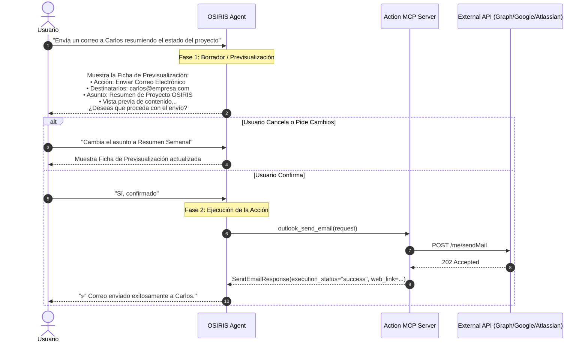

# Plan de Implementación: Suite de Acciones y Escritura en MCPs con Human-in-the-Loop (HITL)

## 📌 Resumen Ejecutivo
Evolucionar los Model Context Protocol (MCP) servers del ecosistema **OSIRIS** de un modelo exclusivamente de lectura (*Read-Only*) a una suite integral con capacidades de acción y mutación de estado (*Read-Write*):
- **Microsoft 365**: Envío de correos y creación de eventos en Outlook, creación de archivos/documentos en OneDrive, y registro de items en SharePoint.
- **Google Workspace**: Creación y subida de documentos en Google Drive, y agendamiento de eventos en Google Calendar.
- **Atlassian**: Creación y comentarios de tickets en Jira, y publicación de páginas en Confluence.
- **Human-in-the-Loop (HITL)**: Mecanismo obligatorio de previsualización y confirmación explícita del usuario antes de ejecutar cualquier acción de escritura.

---

## 🛡️ Protocolo Arquitectónico Human-in-the-Loop (HITL)

### Flujo de Confirmación de Dos Fases
Ninguna herramienta de mutación o escritura se ejecutará automáticamente en un solo turno de conversación.



### Reglas Clave de Seguridad y Guardrails
1. **Dry-Run & Preview Obligatorio**: Las instrucciones del agente y las skills (`_SHARED_AGENT_RULES`, `knowledge-discovery`, `meeting-summary`) prohibirán terminantemente invocar herramientas de mutación sin antes haber presentado la ficha técnica de la acción y haber recibido la confirmación afirmativa del usuario.
2. **Atomicidad e Idempotencia**: Cada tool de escritura retornará un `execution_status`, identificadores únicos del recurso creado y, cuando aplique, enlaces directos de navegación (`webLink`, `gcs_uri`, `browse_url`).
3. **Validación Pydantic Estricta**: Toda validación de emails, fechas ISO8601, tipos MIME y saneamiento de cadenas se ejecutará dentro de los modelos Pydantic `Request` antes de llegar a la capa de API.

---

## 📊 Matriz de Nuevas Herramientas por MCP Server

### 1. Microsoft Ecosystem (`mcp_servers/outlook`, `onedrive`, `sharepoint`)

| MCP Server | Nombre de Tool | Método / Endpoint | Schemas Pydantic | Descripción Funcional |
| :--- | :--- | :--- | :--- | :--- |
| **Outlook** | `outlook_send_email` | `POST /me/sendMail` | `SendEmailRequest`<br/>`SendEmailResponse` | Envía correos con soporte para formato HTML, destinatarios principales, CC y adjuntos desde la Landing Zone. |
| **Outlook** | `outlook_create_draft_email` | `POST /me/messages` | `CreateDraftEmailRequest`<br/>`CreateDraftEmailResponse` | Crea un borrador en la carpeta de *Borradores* para revisión manual por parte del usuario. |
| **Outlook** | `outlook_create_calendar_event` | `POST /me/events` | `CreateCalendarEventRequest`<br/>`CreateCalendarEventResponse` | Agenda reuniones con asistentes, descripción enriquecida y generación automática de enlace de Microsoft Teams. |
| **OneDrive** | `onedrive_create_document` | `PUT /me/drive/root:/{path}:/content` | `CreateDocumentRequest`<br/>`CreateDocumentResponse` | Crea o actualiza archivos de texto/markdown/docx en el OneDrive del usuario. |
| **OneDrive** | `onedrive_upload_file` | `POST /me/drive/items/{id}/children` | `UploadFileRequest`<br/>`UploadFileResponse` | Sube un archivo binario/PDF desde la Landing Zone de GCS al OneDrive personal. |
| **SharePoint**| `sharepoint_create_list_item` | `POST /sites/{site_id}/lists/{list_id}/items` | `CreateListItemRequest`<br/>`CreateListItemResponse` | Inserta registros y metadatos estructurados en listas de SharePoint. |

---

### 2. Google Workspace Ecosystem (`mcp_servers/drive`, `mcp_servers/calendar`)

| MCP Server | Nombre de Tool | Método / Endpoint | Schemas Pydantic | Descripción Funcional |
| :--- | :--- | :--- | :--- | :--- |
| **Google Drive** | `drive_create_document` | `POST /drive/v3/files` | `CreateDriveDocRequest`<br/>`CreateDriveDocResponse` | Crea un documento de Google Docs o archivo markdown dentro de una carpeta especificada. |
| **Google Drive** | `drive_upload_file` | `POST /upload/drive/v3/files` | `UploadDriveFileRequest`<br/>`UploadDriveFileResponse` | Transfiere y almacena un archivo desde la Landing Zone hacia Google Drive respetando permisos. |
| **Google Calendar** | `calendar_create_event` | `POST /calendar/v3/calendars/primary/events` | `CreateEventRequest`<br/>`CreateEventResponse` | Crea eventos en Google Calendar con descripción, asistentes y sala de Google Meet automática. |

---

### 3. Atlassian Ecosystem (`mcp_servers/atlassian`)

| MCP Server | Nombre de Tool | Método / Endpoint | Schemas Pydantic | Descripción Funcional |
| :--- | :--- | :--- | :--- | :--- |
| **Jira** | `jira_create_issue` | `POST /rest/api/3/issue` | `CreateJiraIssueRequest`<br/>`CreateJiraIssueResponse` | Crea incidencias (Task, Story, Bug) asignadas a proyectos específicos con prioridad y descripción en formato ADF/Markdown. |
| **Jira** | `jira_add_comment` | `POST /rest/api/3/issue/{id}/comment` | `AddJiraCommentRequest`<br/>`AddJiraCommentResponse` | Publica actualizaciones y comentarios en tickets existentes. |
| **Confluence** | `confluence_create_page` | `POST /wiki/api/v2/pages` | `CreateConfluencePageRequest`<br/>`CreateConfluencePageResponse` | Crea nuevas páginas de documentación dentro del espacio y jerarquía correspondiente. |

---

## 🔐 Matriz de Permisos y Scopes OAuth 2.0

Para habilitar estas operaciones en las plataformas corporativas, se deben actualizar los scopes configurados en los pipelines CI/CD y los App Registrations:

### 1. Microsoft Entra ID (Graph API)
* **Scopes Actuales**:
  `openid offline_access Files.Read.All Sites.Read.All User.Read Mail.Read email Calendars.Read`
* **Nuevos Scopes a Añadir**:
  - `Mail.Send` (Envío directo de correos)
  - `Mail.ReadWrite` (Creación de borradores y gestión de carpetas)
  - `Calendars.ReadWrite` (Creación y modificación de eventos de calendario)
  - `Files.ReadWrite.All` (Creación y carga de archivos en OneDrive)
  - `Sites.ReadWrite.All` (Creación de items en listas de SharePoint)
* **Variable CI/CD Consolidada (`_MICROSOFT_OAUTH_SCOPES`)**:
  ```yaml
  _MICROSOFT_OAUTH_SCOPES: "openid offline_access User.Read email Mail.Read Mail.Send Mail.ReadWrite Calendars.Read Calendars.ReadWrite Files.Read.All Files.ReadWrite.All Sites.Read.All Sites.ReadWrite.All"
  ```

---

### 2. Google Workspace
* **Scopes Actuales**:
  `openid email https://www.googleapis.com/auth/drive https://www.googleapis.com/auth/bigquery https://www.googleapis.com/auth/cloud-platform https://www.googleapis.com/auth/calendar.events.readonly https://www.googleapis.com/auth/meetings.space.readonly`
* **Nuevos Scopes a Añadir / Modificar**:
  - `https://www.googleapis.com/auth/calendar.events` (Reemplaza `.readonly` para permitir agendamiento)
  - `https://www.googleapis.com/auth/documents` (Para creación y edición de Google Docs nativos)
* **Variable CI/CD Consolidada (`_GOOGLE_OAUTH_SCOPES`)**:
  ```yaml
  _GOOGLE_OAUTH_SCOPES: "openid email https://www.googleapis.com/auth/drive https://www.googleapis.com/auth/bigquery https://www.googleapis.com/auth/cloud-platform https://www.googleapis.com/auth/calendar.events https://www.googleapis.com/auth/meetings.space.readonly https://www.googleapis.com/auth/documents"
  ```

---

### 3. Atlassian (Jira & Confluence Cloud 3LO)
* **Scopes Actuales**:
  `offline_access read:jira-work read:jira-user read:space:confluence read:page:confluence read:attachment:confluence read:comment:confluence read:label:confluence search:confluence`
* **Nuevos Scopes a Añadir**:
  - `write:jira-work` (Creación de tickets y edición de campos)
  - `write:page:confluence` (Creación y publicación de páginas)
  - `write:comment:confluence` (Comentarios en páginas)
  - `write:attachment:confluence` (Subida de adjuntos a Confluence)
* **Variable CI/CD Consolidada (`_ATLASSIAN_OAUTH_SCOPES`)**:
  ```yaml
  _ATLASSIAN_OAUTH_SCOPES: "offline_access read:jira-work write:jira-work read:jira-user read:space:confluence read:page:confluence write:page:confluence read:attachment:confluence write:attachment:confluence read:comment:confluence write:comment:confluence read:label:confluence search:confluence"
  ```

---

## 🚀 Plan de Ejecución por Fases

El desarrollo se estructurará siguiendo la estrategia de dos etapas (*Stage 1 Prototyping & Stage 2 CI/CD Deployment*):

```
┌─────────────────────────────────────────────────────────────┐
│ FASE 1: Microsoft Action Suite (Outlook + OneDrive)         │
│  - Outlook: outlook_send_email, outlook_create_draft_email, │
│             outlook_create_calendar_event                   │
│  - OneDrive: onedrive_create_document, onedrive_upload_file │
│  - Unit tests & Pytest mocks                                │
└──────────────────────────────┬──────────────────────────────┘
                               │
┌──────────────────────────────▼──────────────────────────────┐
│ FASE 2: Google Workspace Suite (Drive + Calendar)           │
│  - Drive: drive_create_document, drive_upload_file          │
│  - Calendar: calendar_create_event                          │
│  - Unit tests & Pytest mocks                                │
└──────────────────────────────┬──────────────────────────────┘
                               │
┌──────────────────────────────▼──────────────────────────────┐
│ FASE 3: Atlassian Suite (Jira + Confluence)                 │
│  - Jira: jira_create_issue, jira_add_comment                │
│  - Confluence: confluence_create_page                       │
│  - Unit tests & Pytest mocks                                │
└──────────────────────────────┬──────────────────────────────┘
                               │
┌──────────────────────────────▼──────────────────────────────┐
│ FASE 4: Guardrails HITL & Skills Update                     │
│  - Actualización de prompt del agente (_SHARED_AGENT_RULES) │
│  - Protocolos de confirmación en skills                     │
│  - Actualización de Scopes en YAMLs de Cloud Build          │
└─────────────────────────────────────────────────────────────┘
```

---

## ✅ Plan de Verificación y Testing

1. **Unit Tests (Trinity of Testing)**:
   - **Happy Path**: Verificación de creación de emails, eventos y documentos con payloads completos y respuestas exitosas simuladas.
   - **Edge Cases**: Nombres de archivo con caracteres especiales, cuerpos HTML extensos, múltiples destinatarios, zonas horarias en eventos de calendario.
   - **Failure Modes**: Token expirado (401), cuota excedida (429), recurso no encontrado (404), payload malformado (400).
2. **Validación de Linters y Tipado**:
   - `uvx pre-commit run --all-files` (Ruff, Ruff-format, Terraform fmt).
3. **Verificación de Seguridad**:
   - Validación de tokens y exclusión de parámetros sensibles (`exclude=True` en `AgentDependencies`).
   - Sin almacenamiento de secretos en código.
