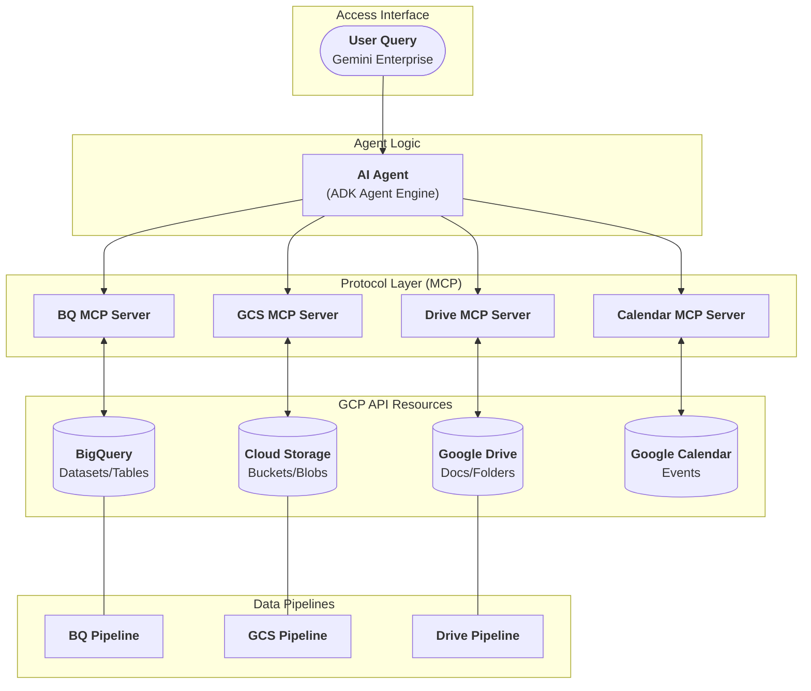

# AI Agents in Gemini Enterprise

This repository is planned to be an accelerator for implementing Gemini Enterprise in any company; allowing to integrate AI Agents capable of reading/writing data from multiple sources, such as:

- Google Drive
- Google Cloud Storage
- BigQuery
- Google Calendar

using the user's permissions to access it, leveraging full AI Agent's capabilities to solve different use cases within a company.

## System Architecture

This project is divided into three main systems:

- Data Pipelines
- MCP Servers
- AI Agents

### Data Pipelines

Data is always in very different formats and sources, this system allows to process it and make it available to the AI Agents based on the different types of authorization.

### MCP Servers

This are the way AI Agents can access the data processed by the Data Pipelines. Due to some Gemini Enterprise pre-built connectors has limited capabilities (read-only tools), it was decided to implement custom MCP Servers for the different data sources, allowing to create, read, and update data (based on user's permissions).

### AI Agents

AI Agents are the core of the system, allowing to address different use cases within a company taking advantage of Gemini Enterprise and the custom MCP servers. So that people within the company can not only interact with the data in a more natural and efficient way, but also automate tasks and processes.

### High-Level Architecture

