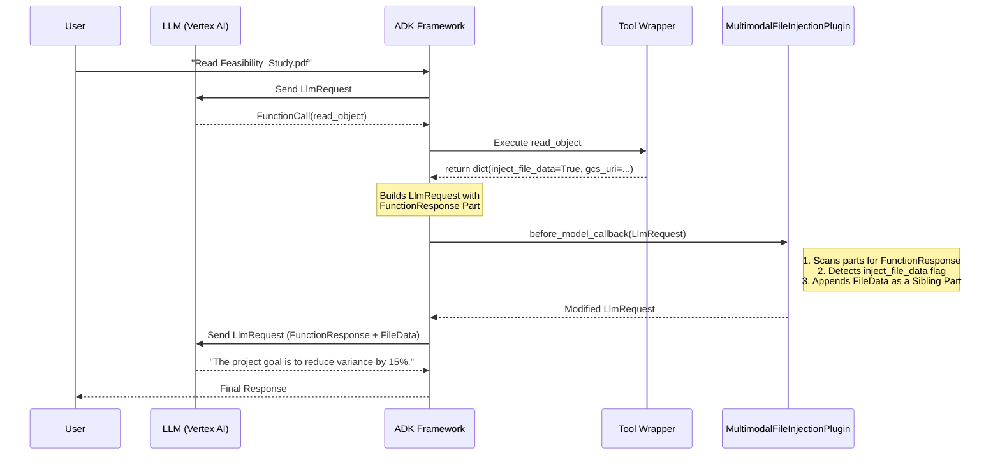

# Multimodal File Injection Plugin

## Overview

The `MultimodalFileInjectionPlugin` is a critical infrastructure component that ensures the LLM can natively read and analyze multimodal files (PDFs, images, etc.) downloaded by external MCP Servers. 

Whenever a tool (like the GCS `read_object` tool) securely downloads a file into the internal Landing Zone, it signals the framework by returning an `inject_file_data = True` flag. This plugin listens for that flag and seamlessly injects the file directly into the LLM's multimodal context.

## The Problem It Solves

Initially, the framework attempted to inject files by manually appending a new `Event` to the session history from within the tool wrapper's execution loop (`session.events.append()`). However, this approach failed due to strict constraints enforced by the **Vertex AI Gemini API**:

1. **Strict Alternating Sequences**: Gemini enforces a strict `User -> Model -> User -> Model` conversation sequence. 
2. **Tool Execution Turns**: When the LLM calls a tool, it outputs a `Model` turn (`FunctionCall`). The framework then executes the tool and outputs a `User` turn (`FunctionResponse`).
3. **The Breakage**: Injecting a new event mid-turn resulted in `Model (FunctionCall) -> User (Injected File) -> User (FunctionResponse)`. Because there were consecutive user turns, Vertex AI would silently drop the file attachment or reject the request, leading to massive LLM hallucinations.

Furthermore, a tool wrapper's `run_async` method is forced to return a JSON dictionary. The Gemini API strictly forbids embedding a `types.FileData` object *inside* a `FunctionResponse` JSON struct.

## The Solution

## Why a Plugin instead of a Tool Wrapper?

A `ToolWrapper` acts completely *inside* the execution phase of a tool (i.e. modifying `args` before the tool runs, and modifying the `result` dictionary after it runs). However, the Gemini API imposes strict limitations:
- A `ToolWrapper` can only return a standard JSON dictionary as the `FunctionResponse`.
- The Vertex AI API strictly forbids embedding native `types.FileData` parts *inside* a `FunctionResponse` JSON struct.
- In order for the LLM to read the file, the `types.FileData` must be injected as a **sibling** part to the `FunctionResponse` inside the final `LlmRequest` payload.

Because Tool Wrappers execute *before* the ADK framework builds the final `Content` and `LlmRequest` blocks, they physically do not have access to modify the request payload. By contrast, a Plugin hooks into the entire framework lifecycle. 

By implementing `before_tool_callback`, `after_tool_callback`, and `before_model_callback` inside a single Plugin, we can cleanly inject the required dependency arguments before the tool runs, format the success message after the tool runs, and ultimately intercept the final `LlmRequest` just before it hits Vertex AI to append the native `FileData` sibling.

## Architecture

## Internal Structure

Because this plugin is highly specialized and focuses entirely on modifying the `LlmRequest` payload, it does not require external configuration (`config.py`) or custom Pydantic schemas (`schemas.py`). It operates purely on the standard `google.genai.types` objects provided by the ADK.
