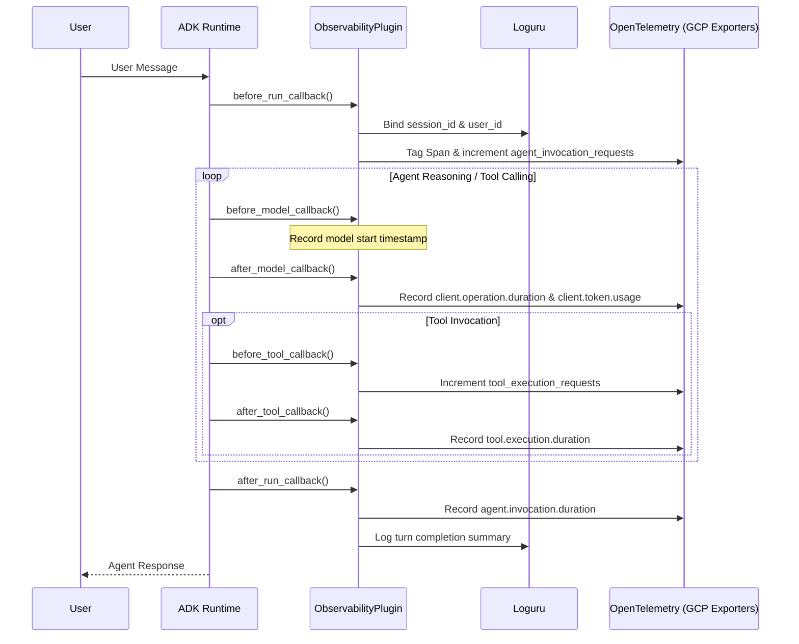

# Observability Plugin

## Overview
The `ObservabilityPlugin` provides complete, non-intrusive lifecycle telemetry across the entire Google ADK agent execution path. It unifies the three pillars of observability (**Tracing**, **Logging**, and **Metrics**) by bridging OpenTelemetry and Loguru directly into Google Cloud Operations suite (**Cloud Trace**, **Cloud Logging**, and **Cloud Monitoring**).

---

## What This Plugin Does

1. **Distributed Tracing Context Enrichment**:
   - Injects contextual user and session attributes (`session_id`, `user_id`) into active OpenTelemetry spans in Cloud Trace.
   - Correlates multi-turn user conversations across foundation model calls and MCP tool invocations.

2. **Contextual Structured Logging (Loguru)**:
   - Enriches every log output with `session_id` and `user_id` context.
   - Logs agent turn start/completion events, latencies, and tool lifecycle warnings.

3. **GenAI Semantic Metrics Emission**:
   - Emits standardized OpenTelemetry GenAI metrics to Google Cloud Monitoring under `workload.googleapis.com/*`.
   - Captures both transactional counters and high-resolution latency/token histograms:
     - `gen_ai.agent.invocation.requests` (Counter): Total agent turn requests received.
     - `gen_ai.agent.invocation.errors` (Counter): Total agent turn failures, categorized by `error.type`.
     - `gen_ai.tool.execution.requests` (Counter): Tool calls initiated, dimensioned by `gen_ai.tool.name` and agent.
     - `gen_ai.tool.execution.errors` (Counter): Tool failures, categorized by `error.type`.
     - `gen_ai.agent.invocation.duration` (Histogram): Total latency per agent turn in seconds.
     - `gen_ai.tool.execution.duration` (Histogram): Individual tool execution latency in seconds.
     - `gen_ai.client.operation.duration` (Histogram): Latency of model generation calls (`generate_content`).
     - `gen_ai.client.token.usage` (Histogram): Token counts categorized by `gen_ai.token.type` (`input` and `output`).

---

## Architecture & Lifecycle Hooks



---

## How to Use It

### 1. Initialization Prerequisite
Observability exporters must be initialized at agent startup before building the agent. This is orchestrated via `setup_observability()`:

```python
from agent.core_agent.observability import setup_observability

# Configure Cloud Trace, Cloud Logging bridge, and Cloud Monitoring
setup_observability()
```

### 2. Registration in AppBuilder
Register `ObservabilityPlugin` in the application pipeline inside `agent/core_agent/agent.py`:

```python
from agent.core_agent.plugins.observability_plugin import ObservabilityPlugin
from agent.core_agent.builder import AppBuilder

app = (
    AppBuilder(
        agent=root_agent,
        gcp_config=GCP_CONFIG,
        agent_config=COORDINATOR_CONFIG,
    )
    .with_plugins([
        ObservabilityPlugin(),
        # other plugins...
    ])
    .build()
)
```

---

## File Structure
- `plugin.py`: Contains `ObservabilityPlugin` implementation, managing hooks and timing calculations.
- `metrics.py`: Defines the OpenTelemetry `Meter` (`gcp.vertex.agent`) and custom operational counters.
- `README.md`: This documentation.
