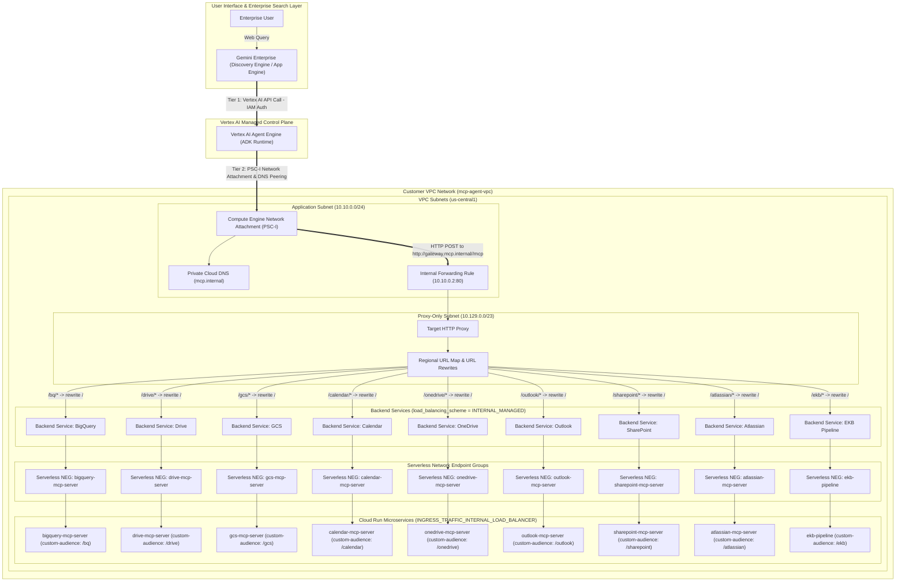

# ADR-003: Network Strategy for MCP Servers and Agent Runtime

**Status**: Accepted  
**Date**: August 21, 2026  
**Owner**: Cloud Architecture & DevOps / Platform Engineering  
**Related Systems**: Vertex AI Reasoning Engine (Agent Engine), Cloud Run MCP Servers, EKB Pipeline, Regional Internal Application Load Balancer (ILB), Serverless NEGs, Cloud DNS, VPC Networking  

---

## 1. Context

The Research-Agent architecture integrates an AI Agent running inside the **Vertex AI Agent Engine (ADK Runtime)** with a suite of microservices deployed as **Google Cloud Run** containers:
- Model Context Protocol (MCP) Servers (BigQuery, Google Drive, GCS, Google Calendar, Microsoft OneDrive, Microsoft Outlook, Microsoft SharePoint, Atlassian Jira/Confluence).
- Enterprise Knowledge Base (EKB) ingestion pipeline.

### The Security & Networking Challenge
Enterprise security baselines and Organization Policies require that all Cloud Run backend microservices enforce **internal ingress only** (`INGRESS_TRAFFIC_INTERNAL_LOAD_BALANCER` or `INGRESS_TRAFFIC_INTERNAL_ONLY`), strictly prohibiting direct public internet access.

When Cloud Run services enforce internal ingress:
1. Google Front End (GFE) disables public DNS resolution and edge routing for the default `https://<service-name>-<hash>.a.run.app` URLs.
2. The managed Vertex AI Agent Engine runtime, when attempting direct HTTPS calls to those default Cloud Run URLs, fails with `HTTP 404 Not Found` or `HTTP 403 Forbidden: Access blocked by ingress settings`.

Therefore, a robust, private networking layer is required to bridge the managed Vertex AI Agent Engine with internal-only Cloud Run microservices.

---

## 2. Decision

A **Regional Internal Application Load Balancer (L7 Envoy-based ILB)** will be implemented, paired with **Serverless Network Endpoint Groups (NEGs)**, a **Private Service Connect Network Attachment (PSC-I)**, and a **Private Cloud DNS Zone (`mcp.internal`)** within the Customer VPC.

All Cloud Run services standardize on:
```hcl
service_config = {
  ingress          = "INGRESS_TRAFFIC_INTERNAL_LOAD_BALANCER"
  custom_audiences = ["http://gateway.mcp.internal/<service_prefix>"]
}
```

The AI Agent routes all MCP tool invocations to the centralized internal gateway domain `http://gateway.mcp.internal/<service_path>`, which rewrites the path prefix and routes internally across private Google infrastructure.

---

## 3. Architectural Topology & Two-Tier Communication Model

The architecture establishes a strict **Two-Tier Communication Model**:
1. **Tier 1 (Control Plane - Gemini Enterprise to Agent Engine)**: Operates over Google's managed API control plane (`aiplatform.googleapis.com`). Gemini Enterprise invokes the Agent Engine using IAM authorization (`roles/aiplatform.user`). This layer is completely decoupled from VPC ingress restrictions, allowing Gemini Enterprise to seamlessly dispatch user queries and receive streamed responses.
2. **Tier 2 (Data Plane - Agent Engine to Cloud Run MCP Microservices)**: Operates 100% within the Customer VPC. When the agent decides to invoke an MCP tool, traffic is routed through the Regional Internal Application Load Balancer and Private Cloud DNS directly to the private Cloud Run containers.



---

## 4. Technical Constraints, Identified Behaviors, and Root-Cause Solutions

### 4.1. Vertex AI PSC-I Network Attachment Permissions (`roles/compute.networkAdmin`)
* **Behavior**: When Vertex AI Agent Engine establishes its Private Service Connect Interface (PSC-I) into the customer VPC's Network Attachment (`mcp-agent-vpc-network-attachment-us-central1`), Google's internal control plane triggers a `NetworkAttachmentsService.Patch` API operation.
* **Constraint**: The standard `roles/compute.networkUser` role only grants read and attachment consumption permissions (`compute.networkAttachments.get` and `compute.networkAttachments.use`). It lacks `compute.networkAttachments.update`.
* **Solution**: The Vertex AI Service Agent identity (`service-${PROJECT_NUMBER}@gcp-sa-aiplatform.iam.gserviceaccount.com`) must be granted **`roles/compute.networkAdmin`** on the project hosting the Network Attachment.

### 4.2. Vertex AI Private DNS Peering Configuration (`DnsPeeringConfig`)
* **Behavior**: The Agent Engine container runtime in the tenant project must resolve private domain names such as `gateway.mcp.internal`.
* **Required IAM**: The Vertex AI Service Agent requires **`roles/dns.peer`** on the target project to establish DNS peering with the VPC's Cloud DNS private managed zone.
* **API Schema Constraints**: When registering `DnsPeeringConfig` via Python SDK (`AgentEngineConfig`) or Terraform, the parameters must adhere strictly to the following formatting:
  * `domain`: Must end with an explicit trailing period (e.g., `"mcp.internal."`).
  * `target_project`: Mandatory parameter containing the GCP Project ID hosting the Cloud DNS zone.
  * `target_network`: Must be the simple VPC Network name (e.g., `"mcp-agent-vpc"`), **not** the full resource URI (`"projects/.../global/networks/..."`).

### 4.3. Cloud Run Serverless NEG Backend Services Configuration
* **Behavior**: Regional backend services associated with Serverless NEGs must not define `timeout_sec`.
* **Constraint**: The GCP Compute Engine API returns an invalid argument error if `timeout_sec` is provided on backend services whose backends are of type Serverless NEG.
* **Solution**: `timeout_sec` is omitted in `google_compute_region_backend_service.mcp_backends`.

### 4.4. Cloud Run ID Token Validation and Custom Audiences (`custom_audiences`)
* **Behavior & Root Cause of HTTP 401 Unauthorized**:
  1. When invoking an MCP microservice via the internal gateway, the ADK `McpToolset` generates a Google OIDC ID token for service authentication using the target gateway URL (e.g., `http://gateway.mcp.internal/drive`) as the `aud` (audience) claim.
  2. Google Front End (GFE) in Cloud Run intercepts all incoming requests to validate authentication. By default, Cloud Run only accepts ID tokens whose `aud` claim matches the default public URL (`https://<service-name>-<hash>.a.run.app`).
  3. When an ID token arrives with `aud = "http://gateway.mcp.internal/drive"`, Cloud Run's infrastructure security layer rejects the request with:
     ```text
     "The request was not authorized to invoke this service. The access token could not be verified."
     HTTP/1.1 401 Unauthorized
     ```
* **Solution (`custom_audiences`)**:
  Every Cloud Run microservice must configure `custom_audiences` to explicitly accept its designated gateway URL prefix:
  ```hcl
  service_config = {
    custom_audiences = ["http://gateway.mcp.internal/<service_prefix>"]
  }
  ```
  This permits Cloud Run's GFE layer to validate Google ID tokens minted for `gateway.mcp.internal`, allowing the request to proceed into the container runtime.

### 4.5. Multi-Layer Zero Trust Authentication Model
The architecture implements three distinct, non-overlapping security tiers:
1. **Network Layer (L3/L4)**: `INGRESS_TRAFFIC_INTERNAL_LOAD_BALANCER` completely prevents direct internet ingress. Traffic must originate from the VPC's Envoy proxy subnet.
2. **Infrastructure IAM Layer (L7)**: Google OIDC ID tokens sent in `X-Serverless-Authorization` authenticate the caller identity (`adk-agent@...`) against Cloud Run using `custom_audiences`.
3. **Application & User Authorization Layer (L7 Application)**: The end-user's delegated OAuth 2.0 PKCE access token is passed in `Authorization: Bearer <token>`. Inside the container, the FastMCP `TokenVerifier` validates the token directly against Google Workspace or Microsoft Graph APIs, ensuring strict least-privilege data access per user session.

---

## 5. Communication Flows: Gemini Enterprise vs. Cloud Run MCPs

### 5.1. Tier 1: Gemini Enterprise to Vertex AI Agent Engine
* **Protocol & Endpoint**: HTTPS requests directed to Google Cloud's managed Vertex AI APIs (`https://<region>-aiplatform.googleapis.com/v1/projects/<project>/locations/<region>/reasoningEngines/<id>:query` and `:streamQuery`).
* **Authentication**: Google Cloud IAM service-to-service authorization using the Gemini Enterprise service identity granted `roles/aiplatform.user`.
* **Network Boundary**: Public Google API Control Plane. Because this is a native Google Cloud service-to-service interaction, it is **completely unaffected** by VPC subnets or Cloud Run internal ingress restrictions. Gemini Enterprise can always discover, invoke, and stream responses from the Agent Engine.

### 5.2. Tier 2: Vertex AI Agent Engine to Cloud Run MCP Microservices
* **Protocol & Endpoint**: HTTP requests to `http://gateway.mcp.internal/<service-path>/mcp`.
* **Authentication**: Layer 7 application token verification (Google OAuth 2.0 PKCE user-delegated access tokens passed in `Authorization: Bearer <token>` and Service Account ID tokens in `X-Serverless-Authorization`).
* **Network Boundary & PSC-I Egress**: 100% Private VPC Data Plane. Vertex AI Agent Engine connects to the customer VPC via a dedicated **Compute Engine Network Attachment (`google_compute_network_attachment`)** and **Cloud DNS Peering** (`roles/dns.peer`). When the Agent Engine initiates an MCP tool call, the request exits into `mcp-agent-vpc`, resolves `gateway.mcp.internal` through Private Cloud DNS, hits the Regional Internal Load Balancer on port 80, and is routed via Serverless NEGs directly to the Cloud Run microservices enforcing `INGRESS_TRAFFIC_INTERNAL_LOAD_BALANCER`.

---

## 6. Component Definitions

### 6.1. Compute Engine Network Attachment (`PSC-I`)
* Dedicated network attachment created in the application subnetwork (`google_compute_subnetwork.app_subnet`). It provides the Private Service Connect interface (PSC-I) that allows Vertex AI Agent Engine instances running in the Google tenant project to send egress traffic directly into the customer VPC network.

### 6.2. Cloud DNS Peering (`roles/dns.peer`)
* Grants the Vertex AI Service Agent identity (`service-<project-number>@gcp-sa-aiplatform.iam.gserviceaccount.com`) permission to peer with the customer VPC's Cloud DNS private zone `mcp.internal`, ensuring domain queries from the agent container resolve to the internal forwarding rule IP.

### 6.3. Proxy-Only Subnetwork (`REGIONAL_MANAGED_PROXY`)
* **Purpose**: Google Cloud's Regional Internal Application Load Balancer relies on Envoy proxies running within a dedicated subnet reserved exclusively for load balancer proxies (`purpose = "REGIONAL_MANAGED_PROXY"`, `role = "ACTIVE"`).
* **CIDR Range**: `10.129.0.0/23` allocated within the region (`us-central1`).

### 6.4. Serverless Network Endpoint Groups (Serverless NEGs)
* **Purpose**: Serverless NEGs (`google_compute_region_network_endpoint_group` of type `SERVERLESS`) act as the native GCP bridge connecting the Load Balancer's backend services to Cloud Run without requiring Compute Engine VMs or manual NAT configurations.
* **Granularity**: One Serverless NEG is created per Cloud Run service.

### 6.5. URL Map & Path Prefix Rewriting
* **Purpose**: Provides a unified entry point (`gateway.mcp.internal`) with path-based routing:
  * `http://gateway.mcp.internal/bq/mcp` $\rightarrow$ routes to `bigquery-mcp-server` at `/mcp`
  * `http://gateway.mcp.internal/outlook/mcp` $\rightarrow$ routes to `outlook-mcp-server` at `/mcp`
  * `http://gateway.mcp.internal/drive/mcp` $\rightarrow$ routes to `drive-mcp-server` at `/mcp`
* **Route Action**: Uses `path_prefix_rewrite = "/"` to strip the path prefix so that the underlying FastMCP server receives its expected `/mcp` root endpoint without modifying the Python application code.

### 6.6. Private Cloud DNS (`google_dns_managed_zone`)
* **Zone Name**: `mcp-internal-zone` (`mcp.internal.`)
* **Scope**: Visibility is set to `private`, linked directly to the VPC network.
* **Records**: An `A` record (`gateway.mcp.internal`) and wildcard (`*.mcp.internal`) resolving to the Internal IP of the Load Balancer Forwarding Rule.

---

## 7. Consequences

### 7.1. Positive
* **Full Network Isolation**: MCP servers and EKB pipelines cannot be reached or probed from the public internet.
* **Simplified Configuration**: Developers and agents target a single, consistent internal domain (`http://gateway.mcp.internal/<service_prefix>`) instead of managing dynamic, random Cloud Run hash URLs.
* **Zero Infrastructure Drift**: `custom_audiences`, IAM bindings, network attachments, and subnets are 100% codified in Terraform.
* **Defense-in-Depth**: In addition to private network isolation, all MCP servers enforce multi-tier authentication via Google OIDC ID tokens and end-user OAuth 2.0 PKCE access tokens.

### 7.2. Negative / Operational Notes
* **Terraform Stack Dependency**: The `agent_gateway_resources` Terraform stack must be deployed after MCP servers exist (so Cloud Run services are available for NEGs) and before the AI Agent is deployed (so the internal endpoints resolve).
* **Proxy-Only Subnet**: The VPC network must have IP address space available for the `10.129.0.0/23` proxy-only subnet in the deployment region.

---

## 8. Implementation Reference

* **Terraform Module**: [`terraform/agent_gateway_resources/`](../../terraform/agent_gateway_resources/)
* **Module Documentation**: [`docs/modules/agent_gateway.md`](../modules/agent_gateway.md)
* **Orchestrator Integration**: [`terraform/scripts/creation_manager.sh`](../../terraform/scripts/creation_manager.sh) (Step 5.5)
* **Cloud Run Base Module**: [`terraform/base_modules/cloud-run-v2/variables.tf`](../../terraform/base_modules/cloud-run-v2/variables.tf)
