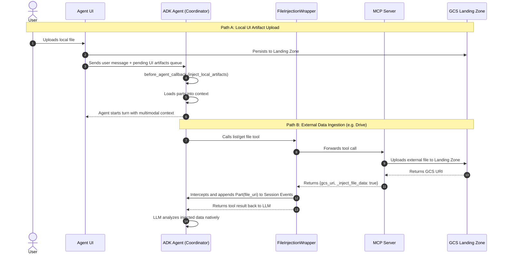

# 07 - Artifact Management and External Files

This document outlines the architecture and workflows for managing user-uploaded artifacts and integrating external data sources into the agent's context.

## 1. Overview

The artifact management system provides a seamless way for the agent to ingest, analyze, and persist external data (e.g., local uploads, Google Drive files). To keep the architecture scalable and unified, all file injections converge on a centralized **GCS Landing Zone Bucket**. 

This system handles two primary paths:
1. **Local UI Artifacts**: Files explicitly uploaded by the user through the chat interface.
2. **External Data Ingestion**: Files discovered and processed by MCP servers from external integrations (e.g., Google Drive).

## 2. Global Architecture

## 3. Storage Convention

All files (local uploads or external MCP ingested files) must be stored in the designated GCS bucket defined in `config.py` as `LANDING_ZONE_BUCKET`.

The canonical naming convention is:
`gs://{LANDING_ZONE_BUCKET}/<user_id>/<session_id>/<data_source>-<ingestion-timestamp-in-UTC>_<filename>.<extension>`

- **user_id**: The email or ID of the authenticated user.
- **session_id**: The active ADK session ID.
- **data_source**: The origin of the file (e.g., `google_drive`, `confluence`, `ui_upload`).
- **ingestion-timestamp**: The UTC time of ingestion (e.g., `20231025T103000Z`).

## 4. MCP Server Integration Rules

When creating or updating MCP Servers that read files:
1. **Never return raw bytes**: The tool must never return raw file text or bytes directly in the JSON response payload.
2. **Move to Landing Zone**: The MCP Server must upload the file to the GCS Landing Zone using the naming convention defined above.
3. **Dependency Injection**: The `user_id` and `session_id` must be injected from the agent's request context (e.g. HTTP headers), rather than expecting the LLM to supply them as string arguments.
4. **Auto-Injection Flag**: The tool response should return a dictionary containing the generated `gcs_uri` and a special flag `_inject_file_data: true`.
5. **Mid-turn Injection**: The `FileIngestionToolWrapper` intercepts this flag and mutates the ADK `Session` event history to seamlessly append the GCS URI as a native Multimodal Part, allowing the LLM to reason over it instantly without an extra turn.

## 5. Artifact Loading via Dependency Injection

A common concern when using the ADK's native `load_artifact()` is that it might fetch the raw bytes or text of the file into the conversation context, which is expensive for tokens. 

However, we override this behavior through **Dependency Injection**:
1. In `app_builder.py`, we construct the `AdkApp` and explicitly inject our custom `StorageService` (from `agent/core_agent/artifact_management/service.py`) as the global `artifact_service_builder`.
2. As a result, whenever the ADK framework encounters a `load_artifact()` call (such as in the `inject_local_artifacts` callback), it automatically delegates the execution to our custom `StorageService`.
3. The custom `StorageService._load_artifact()` is explicitly programmed to return a lightweight Gemini `types.Part(file_data=...)` object pointing to the `gs://` URI, completely bypassing raw byte downloads and guaranteeing **zero-copy** context ingestion.

## 6. Architectural Design: The FileIngestionToolWrapper

The `FileIngestionToolWrapper` is implemented as a proxy class that inherits from `BaseTool` (the Decorator pattern), rather than a simple Python function callback. This design choice is critical for the following reasons:

1. **Decorating Existing Instantiated Tools**: The agent's `agent_builder.py` aggregates fully instantiated, complex tool objects (e.g., `MCPToolset`, `SkillToolset`). We are not creating new standalone tools; we are augmenting the behavior of existing ones.
2. **Preserving the Gemini Schema**: Every ADK tool must expose a `_get_declaration()` method to tell the Gemini LLM about its parameters. By subclassing `BaseTool`, the wrapper transparently proxies this call to the `original_tool`, ensuring Gemini sees the exact same parameters and description without requiring complex reflection or dynamic function generation.
3. **Mid-Turn Interception**: The wrapper intercepts the specific `run_async` execution of the tool it wraps. It executes the tool, evaluates the returned dictionary for the `_inject_file_data` flag, and directly modifies the active session's event history before returning control to the LLM.

## 7. Components

- `agent/core_agent/callbacks/inject_local_artifacts.py`: An `before_agent_callback` that drains the `PENDING_UI_ARTIFACTS_QUEUE` to load user-uploaded files into the session.
- `agent/core_agent/callbacks/file_ingestion.py`: Contains `FileIngestionToolWrapper` which decorates tools to intercept `_inject_file_data` responses and append them to the session history mid-turn.
- `LANDING_ZONE_BUCKET`: Configured via `.env` and `agent_settings.py` (default: `{project_id}-ai-agent-landing-zone`).
