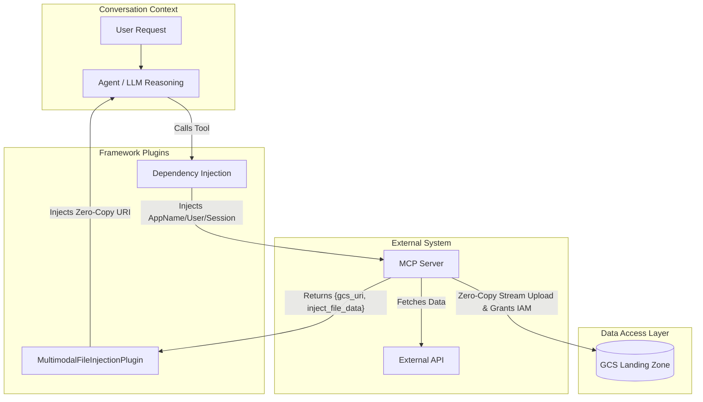
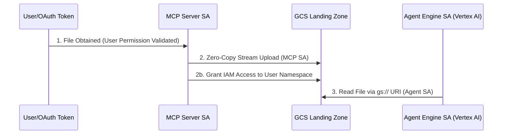

# Storage & Ingestion Architecture

This document explains the architecture of the artifact storage and external data ingestion pipeline for the GE Agent Engine.

## Overview

The system utilizes a **zero-copy** context ingestion strategy. Rather than passing massive binary blobs through the agent's memory or over JSON-RPC, the system dynamically translates all external files into lightweight `gs://` URI references using a centralized GCS Landing Zone.

There are two primary actors in the external data ingestion lifecycle:
1.  **The MCP Server**: Acts as the ingestor. It reads external data (e.g., Google Drive, OneDrive) and directly uploads it to the Landing Zone, managing IAM dynamically.
2.  **The Framework Plugins**: The `MultimodalFileInjectionPlugin` intercepts the resulting GCS URIs mid-turn and injects them into the LLM's context window.



---

## 1. External Data Ingestion (The MCP Server)

When an MCP Server needs to read or process files from external data sources (Google Drive, OneDrive, Confluence), it **MUST NOT** return the raw file content directly to the agent. It relies on the GCS Landing Zone.

### Landing Zone Conventions
Files are uploaded to the central GCS Landing Zone bucket (`LANDING_ZONE_BUCKET`) using a strict folder naming convention required by the ADK Artifact system:

`gs://{LANDING_ZONE_BUCKET}/<app_name>/<user_id>/<session_id>/<data_source>-<ingestion-timestamp-in-UTC>-<filename>.<extension>`

### Security Constraints (MANDATORY)
The MCP server itself is responsible for security, not the core agent engine:
1. **IDOR Prevention**: The server validates the user has legitimate access to the external file payload *before* ingesting it (e.g., mathematically proving access by reading at least 1 byte via delegated OAuth token).
2. **Dynamic Authorization**: After ingestion using the MCP Service Account, the MCP server automatically grants the user read access to their specific namespace folder by injecting an IAM condition into the bucket's IAM policy:
   ```cel
   resource.name.startsWith("projects/_/buckets/<BUCKET_NAME>/objects/<APP_NAME>/<USER_ID>/<SESSION_ID>/")
   ```
3. **Lifecycle Management**: The Landing Zone enforces an Object Lifecycle Management (OLM) rule to physically delete ephemeral files after 7 days.

### Permissions & Rationale Flow



#### Why use a Landing Zone instead of injecting External URIs directly?

While standard developer APIs (like Google AI Studio) may allow passing public or pre-signed `https://` URLs directly into the LLM context, **Enterprise Vertex AI strictly prohibits this** for several critical security and compliance reasons:

1. **Enterprise Compliance & VPC Service Controls (VPC-SC)**: Vertex AI enforces strict data residency and perimeter controls. By requiring `gs://` URIs, Google Cloud ensures the data never leaves your defined Virtual Private Cloud perimeter.
2. **IAM Auditing**: Centralizing all file access through a single GCS Landing Zone guarantees that every file read by the Agent Engine is logged in Cloud Audit Logs. Direct HTTP fetches by the LLM bypass these logs.
3. **IDOR Prevention & Dynamic Authorization**: External APIs often use temporary signed URLs that bypass identity checks once generated. By forcing the data through the Landing Zone, the system enforces our Dynamic Authorization rules (`resource.name.startsWith`), mathematically ensuring the Agent Engine Service Account can only read the file on behalf of the verified user's session.

---

## 2. Dependency Injection

To ensure the MCP Server constructs the correct GCS path and applies IAM policies accurately without LLM hallucination, the framework uses dependency injection.

- **The Flow**: The `app_name`, `user_id`, and `session_id` are injected into the tool's payload via a Plugin's `before_tool_callback`.
- **The Schema**: MCP tools must define their request schemas by inheriting from a `BaseRequest` that hides these dependencies from the LLM using `exclude=True`.

---

## 3. The Tool Hook: Multimodal File Injection Plugin
**Location**: `agent/core_agent/plugins/multimodal_file_injection/main.py`

### `MultimodalFileInjectionPlugin`
- **When it fires**: Mid-turn, right after a Tool or MCP Server finishes executing.
- **What it catches**: Tools returning a response schema with the canonical `gcs_uri` and the `inject_file_data: True` flag.
- **Function**: 
    - This Plugin catches the signal and dynamically forces the GCS URI into the LLM's context window on the fly.
    - This allows the agent to read the newly generated document in its very next reasoning loop using native multimodal vision capabilities, preserving rich structural data (images, charts, tables) that would be lost in plain text extraction.

### Architectural Rationale: Direct MCP Uploads vs. Middleware
It is a deliberate design choice that **MCP Servers upload directly to GCS** rather than returning raw bytes to the Agent Engine (middleware) for uploading.

1. **JSON Bottlenecks**: Massive binary files would have to be base64-encoded, bloating the JSON payload by ~33% and risking HTTP limits.
2. **Memory Exhaustion**: The Python Agent Engine process would have to load every byte into memory, causing severe Out-Of-Memory (OOM) crashes under concurrency.
3. **Loss of Zero-Copy**: By streaming directly to GCS, the heavy binary data completely bypasses the Agent Engine messaging bus.
