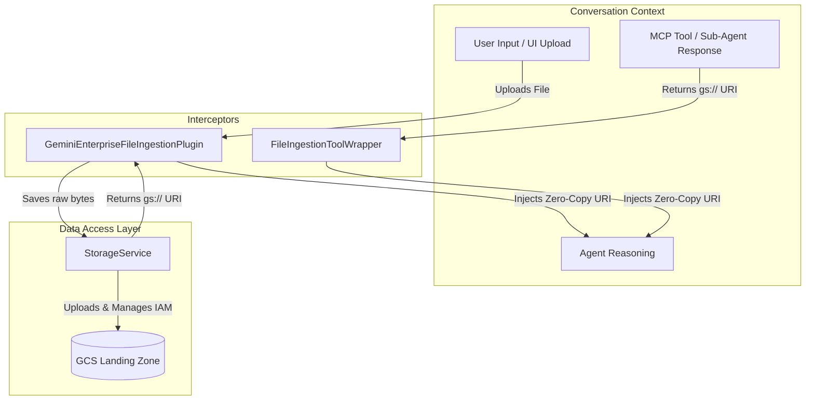

# Storage & Ingestion Architecture

This document explains the architecture of the artifact storage and ingestion pipeline for the Gemini Enterprise agent.

## Overview

The system utilizes a strict Model-View-Controller (MVC) pattern to ensure a clean separation of concerns and guarantee a **zero-copy** context ingestion strategy. Rather than passing massive binary blobs in the agent's memory, the system dynamically translates all files into lightweight `gs://` URI references.

There are three primary layers in the ingestion triad:
1.  **The Database (`StorageService`)**: The core utility that handles all GCS operations and identity-aware IAM security.
2.  **The User Hook (`GeminiEnterpriseFileIngestionPlugin`)**: Intercepts files uploaded explicitly by a user via the Gemini Enterprise UI.
3.  **The Tool Hook (`FileIngestionToolWrapper`)**: Dynamically intercepts files generated or downloaded by backend MCP Servers or Tools mid-turn.



---

## 1. Storage Service (`StorageService`)
**Location**: `agent/core_agent/artifact_service/service.py`

The `StorageService` is the foundational Data Access Layer. It extends the base ADK `GcsArtifactService` to implement enterprise-specific features. It has no awareness of the "Agent" or the "Chat History".

### Key Responsibilities:
- **Reference Management**: When asked to load an artifact (`_load_artifact`), it strictly returns a `types.Part(file_data=...)` pointing to a `gs://` URI, completely bypassing raw byte downloads to keep the prompt token-count low.
- **MIME Type Safety**: Automatically resolves MIME types (falling back to `application/pdf` if unknown).
- **Security Guardrails**: Implements `ensure_uploader_permissions`, protecting against SSRF and Broken Access Control by strictly verifying `bucket_name == self.bucket.name` before granting UBLA IAM Folder permissions.

---

## 2. The User Hook: Ingestion Plugin
**Location**: `agent/core_agent/plugins/gemini_enterprise_ingestion/main.py`

### `GeminiEnterpriseFileIngestionPlugin`
- **When it fires**: On the `on_user_message_callback` (Before the agent sees the message).
- **What it catches**: Gemini Enterprise sends raw bytes (`inline_data`) in the JSON payload when a user clicks "Upload".
- **Function**: 
    - Intercepts the heavy payload before the agent processes it.
    - Uses `StorageService.save_artifact` to offload the bytes to the GCS Landing Zone.
    - Replaces the original binary data in the user's message payload with a lightweight `types.Part(file_data=...)` referencing the new GCS URI.
- **Lazy Discovery**: If a user uploads a massively large file (like a video), the Gemini frontend "pre-stashes" it. The plugin uses `StorageService.get_artifact_metadata` to discover these pre-stashed files and securely associate them.

---

## 3. The Tool Hook: External Data Wrapper
**Location**: `agent/core_agent/callbacks/tool_wrappers/file_ingestion_wrapper/main.py`

### `FileIngestionToolWrapper`
- **When it fires**: Mid-turn, right after a Tool or MCP Server finishes executing.
- **What it catches**: Tools returning a dictionary with `{"_inject_file_data": True}`.
- **Function**: 
    - When a backend MCP Server (like Google Drive or BigQuery) generates or downloads a file, the user never clicked "upload", so the Plugin (#2) misses it.
    - This ToolWrapper catches the signal and dynamically forces the GCS URI into the LLM's context window on the fly, allowing the agent to read the newly generated document in its very next reasoning loop.

### Architectural Rationale: Direct MCP Uploads vs. Middleware
It is a deliberate design choice that **MCP Servers upload directly to GCS** rather than returning raw bytes to the Agent Engine (middleware) for uploading.

If the MCP Server returned raw files to the Agent Engine over JSON-RPC:
1. **JSON Bottlenecks**: Massive binary files (like PDFs or Videos) would have to be base64-encoded, bloating the JSON payload by ~33% and risking HTTP limits.
2. **Memory Exhaustion**: The Python Agent Engine process would have to load every byte into memory just to act as a middleman, causing severe Out-Of-Memory (OOM) crashes under concurrency.
3. **Loss of Zero-Copy**: By having the MCP Server stream directly to GCS and return only a 50-byte `gs://` string, the heavy binary data completely bypasses the Agent Engine messaging bus.
4. **Native Multimodal Context**: If the MCP Server tried to extract text locally and just return strings, all rich structural data (images, charts, tables) would be lost. Uploading the raw file to GCS allows the Agent Engine to pass the raw URI to Gemini, allowing the LLM's native multimodal vision capabilities to "see" the exact original file, preserving all layouts and visual elements.

While this tightly couples the MCP Server to GCP infrastructure, in an Enterprise environment, the performance, stability, and scalability gains of this pure Zero-Copy approach vastly outweigh the theoretical benefits of decoupling.

---

## Security Model: Identity-Aware IAM

To comply with Enterprise security standards, the agent uses **Uniform Bucket-Level Access (UBLA)** with **IAM Conditions**.

### UBLA IAM Folder Permissions
**UBLA (Uniform Bucket-Level Access)** is GCP's standard for managing access uniformly across an entire bucket rather than individual objects. However, because we use a single Landing Zone bucket for all users, we must simulate "Folder-Level" isolation. 

We achieve this by dynamically binding the `roles/storage.objectViewer` role to the user's specific identity (e.g., `user:joe@example.com`) combined with a precise **IAM Condition**. This ensures the user can only read objects within their exact session directory:

```cel
resource.name.startsWith("projects/_/buckets/<BUCKET_NAME>/objects/<APP_NAME>/<USER_EMAIL>/")
```

### Benefits:
- **Privacy**: Users cannot list or access files belonging to other users.
- **Scalability**: Reduces IAM policy bloat by using one binding per user per app, rather than one per file.
- **Auditability**: Every file is stamped with `uploader: <email>` metadata.
