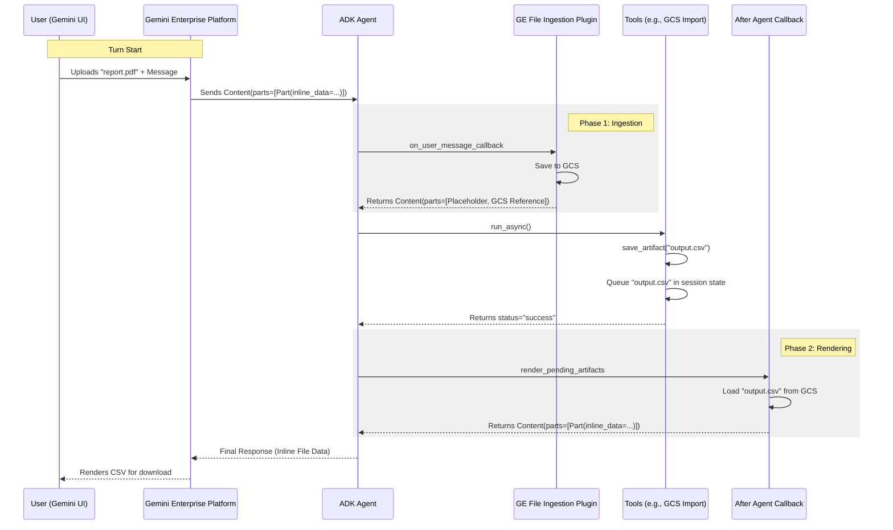

# 09 - App Architecture and Deduplication

This document describes the structural refinements made to the Research-Agent to ensure production stability, strict type safety, and optimized handling of recursive artifact uploads in Gemini Enterprise.

## 1. Unified App Construction Pattern

To maintain absolute parity between Local Development and Production, the application utilizes a "Base-to-Wrapper" construction pattern in the `AppBuilder`.

### The Strategy
1.  **Construct Base App**: The builder first creates a standard `google.adk.apps.app.App`. This instance contains all the "business logic" (Agent, Toolsets, Plugins).
2.  **Evaluate Environment**:
    *   **Local**: Returns the base `App` directly. Storage and tracing are managed via external CLI flags in the `Makefile`.
    *   **Production**: Wraps the base `App` into a `vertexai.agent_engines.AdkApp`. This adds the production-grade `GcsArtifactService` and enables tracing features.

This approach guarantees that if a plugin or tool works locally, it will behave identically in production because the underlying `App` object is shared.

---

## 2. Type Safety and Fluent API

The builder package (`agent/core_agent/builder/`) implements strict Python typing standards to improve maintainability and prevent runtime errors.

- **Explicit Unions**: Replaced `|` with `Union` from the `typing` module for return types.
- **Lowercase Built-ins**: Standardized on `list[]` instead of `List[]`.
- **No `Any`**: Replaced all `Any` occurrences with specific types or `BasePlugin` / `BaseAgent` base classes.
- **Fluent Interface**: Chaining methods like `.with_plugins()` or `.with_skills()` ensures a declarative and readable configuration flow.

---

## 3. Recursive Artifact Prevention

### The Challenge: Functional Overlap
In Gemini Enterprise, multi-modal files uploaded to the chat are re-transmitted by the platform on **every turn**. This is done to ensure the LLM always has the full context of the files.

Research reveals a significant **functional overlap** between the Gemini Enterprise UI and the ADK's programmatic storage logic:
1.  **Platform Ingestion**: When a user submits a file via the chat interface, Gemini Enterprise handles the initial ingestion internally, creating a reference (Version 0) within the system's managed storage.
2.  **Plugin Redundancy**: If a standard `SaveFilesAsArtifactsPlugin` is enabled, it intercepts the message and attempts to save it again. Because the ADK artifact service is version-sensitive, it perceives this as a second save, immediately creating **Version 1** after the UI's **Version 0**.
3.  **The Paradox**: Using programmatic saving plugins prevents the UI from displaying the file (as it strips the inline data), while keeping data inline leads to token exhaustion and redundant storage conflicts.

### The Solution: Conditional Plugin Registration
The `AppBuilder` resolves this overlap by strictly isolating artifact persistence to the local development environment.

#### Implementation Strategy:
1.  **Production (PROD_EXECUTION=True)**: The application registers **zero** artifact plugins. This allows Gemini Enterprise to handle grounding and rendering natively, ensuring that uploaded files are displayed correctly and that only Version 0 exists in GCS.
2.  **Local (PROD_EXECUTION=False)**: The application registers the standard `SaveFilesAsArtifactsPlugin`. This ensures that local development (via `adk web`) still allows the agent to interact with uploaded files as versioned artifacts.
3.  **Sanitization via Grounding**: In production, the model relies on the platform's grounding logic rather than programmatic message interception, resolving the rendering paradox.

#### Builder Configuration in `app_builder.py`:
```python
self._registered_plugins = (
    [] if gcp_config.PROD_EXECUTION else [SaveFilesAsArtifactsPlugin()]
)
```

---

## 4. Post-Turn Rendering Pipeline (GE Compatibility)

### The Challenge: Tool Response Limitations
As documented in [ADK Python Issue #4273](https://github.com/google/adk-python/issues/4273), Gemini Enterprise only renders files that are returned directly in the final agent response as inline `types.Part` objects. 

However, to maintain clean API schemas and prevent parsing errors, ADK tools must return simple types like `str` or `dict`. This creates a gap where files saved during a tool execution are stored in GCS but remain invisible to the user in the Gemini UI.

### The Solution: The "Stash-and-Render" Pattern
The Research-Agent implements a post-turn rendering pipeline using the `after_agent_callback`:

1.  **Stash**: Tools (like `ImportGcsToArtifactTool`) perform their logic, save the result to the artifact store, and then "stash" the filename in the session state under the `pending_artifact_renders` key.
2.  **Render**: After the agent completes its turn, the `render_pending_artifacts` callback executes. It retrieves all filenames from the stash, loads them from GCS as inline `types.Part` objects, and appends them to the final model response.

---

## 5. Gemini Enterprise File Ingestion

### The Challenge: ADK vs. GE Ingestion
Files uploaded directly in the Gemini Enterprise UI are sent as inline `Part` objects in the user message. Unlike the local ADK Web UI, Agent Engine deployments do not automatically persist these files to the agent's GCS bucket. 

### The Solution: `GeminiEnterpriseFileIngestionPlugin`
This custom plugin ensures that user-uploaded files are both persistent and referenceable by the agent:

1.  **Intercept**: The plugin catches the `on_user_message_callback`.
2.  **Persist**: It saves every inline binary part to the configured `GcsArtifactService`.
3.  **Reference**: It replaces the heavy binary payload with a lightweight GCS URI reference (`file_data`), allowing the agent to "see" the file without consuming excessive input tokens on subsequent turns.

---

## 6. End-to-End GE Artifact Flow



---

## 7. Local Development Parity

While the code is unified, the local runner (`adk web`) often requires explicit CLI configuration to match Cloud behavior.

- **Storage**: Forced via `--artifact_service_uri gs://$(ARTIFACT_BUCKET)` in the `Makefile`.
- **Bucket Resolution**: The `Makefile` and `GCPConfig` (via `AliasChoices`) both handle the mapping between `.env` names (like `ARTIFACT_STAGING_BUCKET`) and the application's required `ARTIFACT_BUCKET` field.
