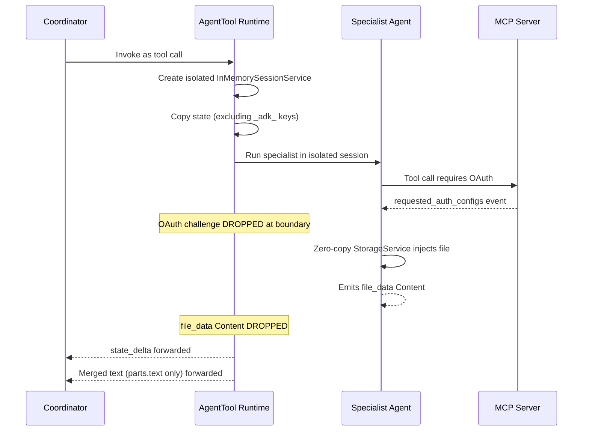
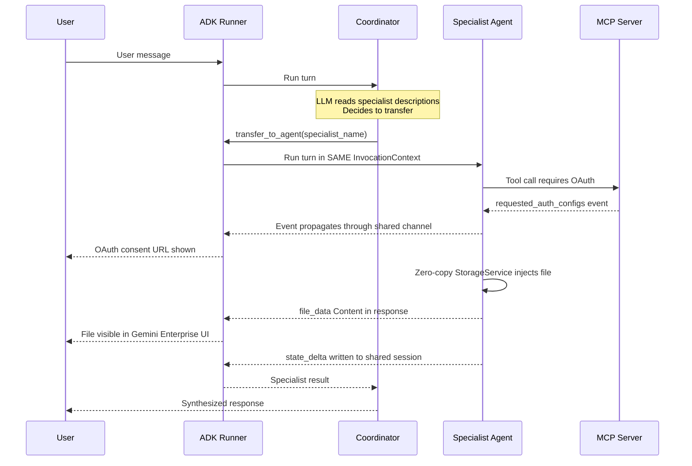
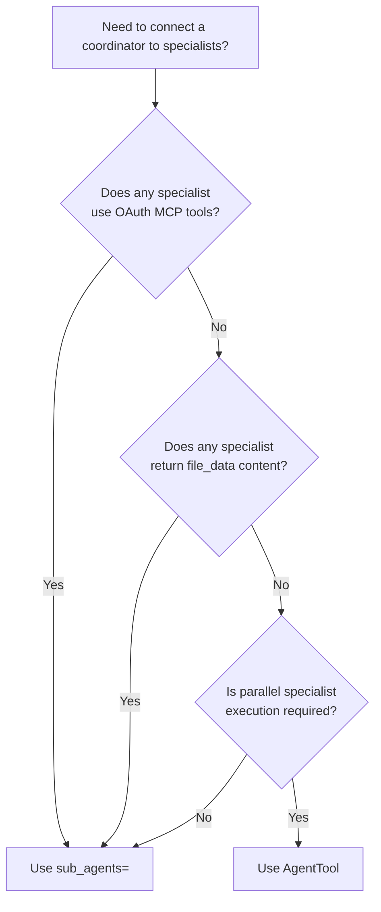

# AgentTool vs. `sub_agents=` — Two Delegation Patterns in ADK

When building multi-agent systems with Google ADK, there are two distinct mechanisms for connecting a Coordinator agent to specialist agents. Each has a different internal execution model with significant implications for session sharing, OAuth propagation, and artifact rendering.

---

## Overview

| Dimension | `AgentTool` | `sub_agents=` |
| :--- | :--- | :--- |
| **API** | `AgentTool(agent=spec)` → `tools=[...]` | `Agent(..., sub_agents=[spec])` |
| **Invocation trigger** | Coordinator's LLM calls it like a function tool | Coordinator's LLM transfers control via agent description |
| **Session** | **Isolated** — new `InMemorySessionService` per call | **Shared** — same session and invocation context |
| **Parallelism** | ✅ Multiple specialists can run in one LLM turn | ❌ Sequential — one specialist per turn |
| **OAuth propagation** | ❌ Auth events dropped at isolation boundary | ✅ Auth events reach the user |
| **`file_data` in response** | ❌ Stripped — only `.text` parts forwarded | ✅ Full content forwarded |
| **`before_agent_callback`** | ❌ Fires inside isolated session, effects discarded | ✅ Fires in user's session, effects visible |

---

## Pattern 1: `AgentTool` — Explicit Tool Invocation

### Concept

`AgentTool` wraps a specialist `Agent` as a regular callable tool. The Coordinator's function-calling LLM can invoke it explicitly — like calling any other tool — and can call multiple specialists in a single turn if needed.

### Internal Mechanics

When the Coordinator invokes an `AgentTool`, the ADK runtime creates a fully isolated execution environment for the specialist:

```python
# Simplified from google.adk.tools.agent_tool.AgentTool.run_async
runner = Runner(
    session_service=InMemorySessionService(),           # ← NEW isolated session
    credential_service=tool_context.credential_service, # shared credentials
    artifact_service=tool_context.artifact_service,     # shared artifact store
    ...
)

# Only non-_adk-prefixed state keys are copied from the parent
state_dict = {
    k: v for k, v in tool_context.state.to_dict().items()
    if not k.startswith("_adk")
}
session = await runner.session_service.create_session(state=state_dict)
```

After the specialist completes, `AgentTool` filters its output before returning to the Coordinator:

```python
async for event in specialist_runner:
    if event.actions.state_delta:
        tool_context.state.update(event.actions.state_delta)  # forwarded
    if event.content:
        last_content = event.content

# Only text is extracted — file_data parts are discarded:
return "\n".join(
    part.text for part in last_content.parts
    if part.text and not part.thought
)
```

### Event Flow



### What Is and Is Not Forwarded

| Forwarded to Coordinator | Dropped at Isolation Boundary |
| :--- | :--- |
| `state_delta` (non-`_adk` keys) | `requested_auth_configs` (OAuth challenges) |
| Final response text (`.text` parts only) | `file_data` parts in final response |
| — | Effects of session callbacks on content |

### When to Use `AgentTool`

- **Parallel specialist execution is required** and specialists do not use OAuth or return `file_data`.
- **Hard session isolation is desired** — each specialist invocation is fully sandboxed.
- **Deterministic, explicit invocation** is preferred over LLM-driven routing.

**Example use case**: A coordinator that orchestrates two pure-text summarisation agents — one for documents and one for emails — and calls both in parallel on each user request.

---

## Pattern 2: `sub_agents=` — LLM-Transfer Delegation

### Concept

Specialist agents are listed in the `sub_agents=` parameter of the `Agent` constructor. The Coordinator's LLM reads each specialist's `description` field and, when it determines a request matches, **transfers control** to that specialist. No new session is created.

### Internal Mechanics

The ADK `Runner` manages the transfer. The specialist runs in the **same `InvocationContext`** as the Coordinator, with full access to the parent session's state, credentials, event channel, and artifact service.

State flows naturally in both directions:

- **Coordinator → Specialist**: The specialist reads `session.state` directly (no copying needed).
- **Specialist → Coordinator**: Any `state_delta` the specialist produces is written to the shared session immediately.

### Event Flow



### What Propagates

Because the same session is active throughout:

| Capability | Behavior |
| :--- | :--- |
| `requested_auth_configs` (OAuth challenges) | ✅ Propagate to user |
| `file_data` parts in final response | ✅ Reach the user |
| Callback effects | ✅ Fire in user's session, visible |
| `session.state` reads | ✅ Full shared access (no copy, no exclusions) |
| `state_delta` writes | ✅ Immediately visible in shared session |

### When to Use `sub_agents=`

- **Any specialist uses OAuth** (e.g., MCP servers for Drive, Calendar, BigQuery).
- **Any specialist returns `file_data` content** (e.g., artifact rendering, PDF imports).
- **Session callback effects must be visible** to the user.
- **Routing logic is well-described** by the specialist's `description` field.

**Example use case**: A coordinator that delegates deep research to a specialist that authenticates against Drive and Calendar MCP servers via OAuth and returns rendered GCS files to the user.

---

## Decision Guide



| Decision Factor | `AgentTool` | `sub_agents=` |
| :--- | :---: | :---: |
| Specialist uses OAuth MCP tools | ❌ | ✅ |
| Specialist returns `file_data` / rendered artifacts | ❌ | ✅ |
| Callback effects must reach user | ❌ | ✅ |
| Parallel specialist execution needed | ✅ | ❌ |
| Hard session isolation / sandboxing required | ✅ | ❌ |
| Explicit, deterministic call control | ✅ | ❌ |

**Rule of thumb**: Choose `sub_agents=` unless you explicitly need parallel specialist execution **and** your specialists do not use OAuth or produce file content.

---

## This Project's Choice and Why

The Research-Agent uses `sub_agents=` delegation. Three concrete requirements drove this decision:

### 1. MCP OAuth Propagation

The Research Specialist connects to Drive, Calendar, BigQuery, and GCS MCP servers — all protected by OAuth 2.0. In local development, the OAuth consent challenge must reach the user's browser to complete the flow. `AgentTool` silently drops `requested_auth_configs` events at the session boundary; `sub_agents=` shares the event channel.

The Research Specialist fetches files via MCP servers that trigger the `FileIngestionToolWrapper`. This wrapper produces `file_data` parts that must appear in the final user-visible response. With `AgentTool`, these parts are stripped by the text-only extraction step. With `sub_agents=`, they flow through the shared session to the user.

### 3. Cross-Turn Research Memory

The specialist uses `output_key="research_context"` to persist findings to `session.state`. While `AgentTool` does copy `state_delta` back to the parent, the direct shared-state model of `sub_agents=` provides cleaner semantics: the coordinator and specialist always agree on what is in state without copy-and-exclusion logic.

> [!NOTE]
> The initial implementation on the `multiagent_refactor` branch used `AgentTool` with the goal of enabling parallel specialist calls. It was reverted to `sub_agents=` after confirming that OAuth challenges were silently dropped and rendered artifacts were stripped. Parallel execution was deprioritized in favour of correctness.

### Why Not a Hybrid?

A hybrid approach — some specialists via `AgentTool`, some via `sub_agents=` — is technically valid but adds architectural complexity and requires per-specialist reasoning about session boundaries. Since all specialists in this system require OAuth and produce file content, `sub_agents=` is the uniform choice.

---

## Related Documents

- **[09-Multi-Agent-Architecture.md](09-Multi-Agent-Architecture.md)**: Full architecture of the three-agent topology and the AgentBuilder pattern.
- **[06-OAuth-Inside-Gemini-Enterprise.md](06-OAuth-Inside-Gemini-Enterprise.md)**: OAuth flow details and the `get_ge_oauth_token` helper.
- **[07-Storage-and-Ingestion-Architecture.md](07-Storage-and-Ingestion-Architecture.md)**: Details on the zero-copy artifact ingestion triad.
