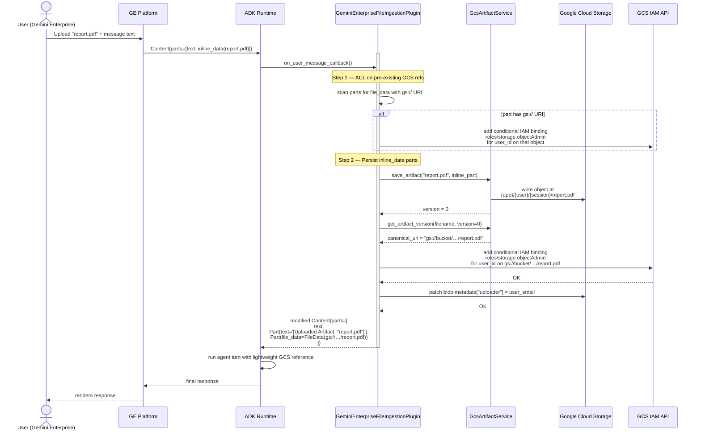
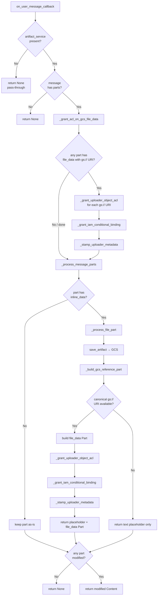
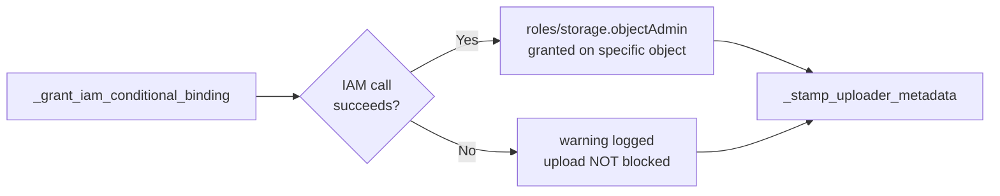
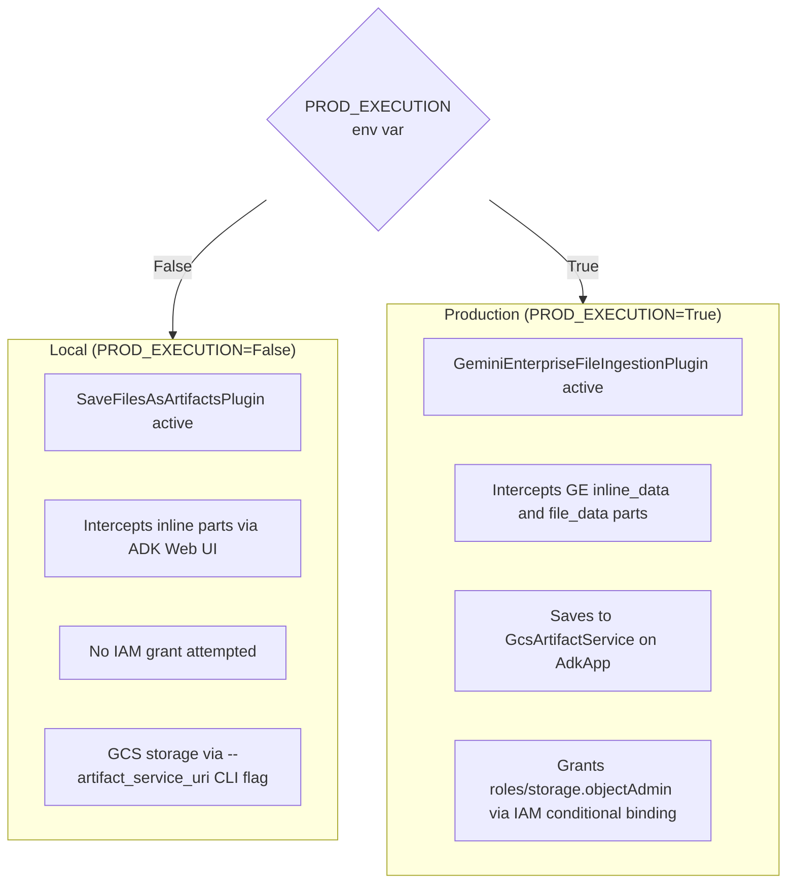

# 10 - User File Uploads in Gemini Enterprise

This document is the definitive reference for understanding how user-uploaded files travel from the
Gemini Enterprise chat UI into the agent runtime, how they are persisted to GCS, and how the
uploader receives `roles/storage.objectAdmin` access on their own object.

---

## 1. The Problem: Why a Custom Plugin Is Needed

When a user uploads a file in the **ADK Web UI** (local development), ADK's built-in
`SaveFilesAsArtifactsPlugin` automatically intercepts the message and persists the inline bytes to
the configured artifact store.

When a user uploads a file in **Gemini Enterprise** (production), that plugin does **nothing
useful**:

| Constraint | Why it matters |
|---|---|
| GE already saves the file as Version 0 internally | Enabling `SaveFilesAsArtifactsPlugin` creates a redundant Version 1 and strips the binary from the message, preventing GE from rendering the file |
| GE sends files as `inline_data` (base64) parts in the user message on every turn | Without persistence, the full binary payload inflates every subsequent token count |
| ADK tools must return `str` or `dict` | Tools cannot return a `types.Part` to GE directly; the schema parser rejects it (see [ADK issue #4273](https://github.com/google/adk-python/issues/4273)) |
| GE only renders files that arrive as inline `types.Part` in the **final agent response** | Files saved silently to GCS are invisible to the user in the chat UI |

The solution is a custom `GeminiEnterpriseFileIngestionPlugin` that:

1. Intercepts the raw user message before it reaches the model.
2. Saves every inline binary part to GCS via the `GcsArtifactService`.
3. Replaces the heavy binary payload with a lightweight GCS `file_data` reference.
4. Grants `roles/storage.objectAdmin` to the uploader on their specific GCS object via an IAM
   conditional binding.

---

## 2. Plugin Registration: Local vs Production

The `AppBuilder` registers a different plugin set depending on the execution environment, controlled
by the `PROD_EXECUTION` flag in `GCPConfig`.

```python
# agent/core_agent/builder/app_builder.py
self._registered_plugins = (
    [GeminiEnterpriseFileIngestionPlugin()]
    if gcp_config.PROD_EXECUTION
    else [SaveFilesAsArtifactsPlugin()]
)
```

| Environment | Plugin active | Reason |
|---|---|---|
| **Production** (`PROD_EXECUTION=True`) | `GeminiEnterpriseFileIngestionPlugin` | Handles GE's native upload format; prevents version duplication |
| **Local** (`PROD_EXECUTION=False`) | `SaveFilesAsArtifactsPlugin` | Standard ADK Web UI behavior; no IAM grant needed locally |

> **Key rule**: never register both plugins simultaneously. Enabling `SaveFilesAsArtifactsPlugin` in
> production is the root cause of the redundancy paradox described in section 1.

---

## 3. What a Gemini Enterprise Message Looks Like

GE delivers uploaded files in one of two shapes depending on file size:

### 3a. Small files — `inline_data` (base64 payload)

```
Content(role="user", parts=[
    Part(text="Analyze this contract:"),
    Part(inline_data=Blob(
        data=<base64-encoded-bytes>,
        mime_type="application/pdf",
        display_name="contract.pdf"
    ))
])
```

### 3b. Large files — `file_data` (pre-uploaded GCS URI)

GE can pre-upload large files directly to a GCS location and pass a URI reference instead:

```
Content(role="user", parts=[
    Part(text="Summarize this report:"),
    Part(file_data=FileData(
        file_uri="gs://some-bucket/path/to/file.pdf",
        mime_type="application/pdf"
    ))
])
```

The plugin handles **both shapes**:

- `inline_data` parts → saved to GCS, replaced with a `file_data` reference + text placeholder.
- `file_data` parts with `gs://` URIs → ACL grant applied directly; no storage needed.

---

## 4. End-to-End Upload Flow

### 4a. High-level sequence



### 4b. Detailed method call chain



---

## 5. Component Reference

All logic lives in `agent/core_agent/plugins/user_uploads.py`.

### `GeminiEnterpriseFileIngestionPlugin` (class)

Registered as an ADK `BasePlugin`. The only public entry point is `on_user_message_callback`.

---

### `on_user_message_callback`

**Trigger**: called by the ADK framework for every incoming user message, before the model sees it.

**Guards** (returns `None` immediately if):
- No `artifact_service` is configured on the `InvocationContext`.
- The message has no parts.

**Steps**:
1. Calls `_grant_acl_on_gcs_file_data` to handle any `file_data` references already in the message.
2. Calls `_process_message_parts` to replace inline binary parts with GCS references.
3. Returns the modified `types.Content` if any part was changed, or `None` to let the message pass through unmodified.

---

### `_grant_acl_on_gcs_file_data`

Scans all message parts. For each part with a `file_data.file_uri` that starts with `gs://`, calls
`_grant_uploader_object_acl`. This covers the case where GE pre-uploaded a large file directly to
GCS before sending the message.

---

### `_process_message_parts`

Iterates over every part. Passes non-inline parts through unchanged. Delegates each `inline_data`
part to `_process_file_part`.

---

### `_process_file_part`

1. Reads `inline_data.display_name` as the filename, or generates a fallback:
   `upload_{invocation_id}_{index}`.
2. Calls `artifact_service.save_artifact(...)` to persist the binary to GCS.
3. Calls `_build_gcs_reference_part(...)` to retrieve the canonical `gs://` URI.
4. If a GCS URI is available, calls `_grant_uploader_object_acl(uri, user_id)`.
5. Returns `[text_placeholder, file_data_part]` replacing the original inline part.
   On any failure, falls back to the original part to avoid data loss.

---

### `_build_gcs_reference_part`

Calls `artifact_service.get_artifact_version(...)` and extracts `canonical_uri`. Returns a
`types.Part(file_data=FileData(file_uri=...))` if and only if the URI starts with `gs://`.

---

### `_grant_uploader_object_acl`

Async orchestrator. Parses the `gs://bucket/object` URI, gets the GCS bucket handle, and runs all
blocking GCS operations inside `asyncio.to_thread` to avoid blocking the event loop. Logs a warning
and continues silently on any failure (never raises, never blocks the upload flow).

---

### `_grant_iam_conditional_binding`

The core permission grant. Uses GCS IAM policy version 3 to add a conditional binding:

```
role:    roles/storage.objectAdmin
member:  user:<user_email>
condition:
  title:      uploader-object-access
  expression: resource.name == "projects/_/buckets/{bucket}/objects/{object}"
```

Before appending, checks for an identical binding to prevent policy bloat on repeated uploads
(e.g. when GE re-sends the same file on the next turn).

---

### `_stamp_uploader_metadata`

Patches `blob.metadata["uploader"] = user_email` on the GCS object. Provides a durable,
human-readable audit trail independent of IAM policy state.

---

## 6. IAM Conditional Binding: Why Not Legacy ACLs

GCS offers two access control models:

| Model | How it works | UBLA compatibility |
|---|---|---|
| **Legacy ACLs** (`blob.acl.user(email).grant_owner()`) | Per-object ACL entries | **Disabled** on UBLA buckets — returns `HTTP 400` |
| **IAM with conditions** (`bucket.set_iam_policy(policy)`) | Bucket-level policy with CEL expression scoped to one object | **Works** regardless of UBLA state |

Landing zone buckets in production always use **Uniform Bucket-Level Access (UBLA)** — it is the
default for new GCS buckets and a GCP security requirement. Legacy ACLs silently fail (or raise a
400) on these buckets.

The plugin uses IAM conditional bindings exclusively. There is no legacy ACL fallback because:

- If UBLA is **ON** (landing zone): IAM works, legacy ACL is disabled → fallback is dead code.
- If UBLA is **OFF**: IAM also works → fallback is redundant.



### Condition expression anatomy

```
resource.name == "projects/_/buckets/my-landing-zone/objects/app/user@corp.com/session-42/report.pdf"
```

- `projects/_` is the GCS wildcard project notation (no project ID needed).
- The full object path scopes the grant to **exactly one file** — not the bucket, not a prefix.
- `roles/storage.objectAdmin` gives the user full control over that single object: read, delete,
  update metadata, manage its own IAM — nothing else in the bucket.

---

## 7. Where `user_id` Comes From

The `user_email` passed to the IAM grant is `invocation_context.user_id`.

In **Agent Engine + Gemini Enterprise**, the ADK framework populates `user_id` from the
authenticated session identity — the Google Workspace email of the user who sent the message. This
is set when the session is created on the GE side and flows through the `InvocationContext` to the
plugin.

> If `user_id` is empty or `None`, `_grant_acl_on_gcs_file_data` exits immediately with a warning
> and no ACL attempt is made.

---

## 8. GCS Object Path Structure

The `GcsArtifactService` writes artifacts at this path:

```
gs://{ARTIFACT_BUCKET}/{app_name}/{user_id}/{session_id}/{filename}
```

Example:

```
gs://ag-core-dev-artifacts/research-agent/user@corp.com/924870560939245568/SoW-Innovation.pdf
```

This path structure means the IAM conditional expression naturally encodes the user's identity,
providing defense-in-depth: even if the IAM condition were mis-scoped, the object path itself is
namespaced per user.

---

## 9. Constraints and Known Limitations

| Constraint | Detail |
|---|---|
| **IAM policy size limit** | GCS bucket IAM policies have a size cap (~64 KB). Each conditional binding adds ~200 bytes. With many users and many files, this can become a concern. Mitigation: the duplicate-check in `_grant_iam_conditional_binding` prevents re-adding the same binding on repeated turns. |
| **Service account must have `storage.buckets.setIamPolicy`** | The agent's service account needs this permission on the artifact bucket. Without it, `_grant_iam_conditional_binding` raises and logs a warning. The upload still succeeds. |
| **GE re-sends files every turn** | On every new user message, GE re-sends all previously uploaded inline parts. The plugin processes them each time but the duplicate-binding check ensures no policy bloat. |
| **`user_id` must be a Google Workspace email** | IAM `user:` bindings require a valid Google account email. Internal opaque session IDs won't resolve in IAM. |
| **Metadata `uploader` is informational only** | `blob.metadata["uploader"]` is a convenience label for auditing. It does not enforce access control. |

---

## 10. Local Development vs Production



To test the plugin locally against a real GCS bucket (not the ADK Web UI), set `PROD_EXECUTION=True`
in `.env` and provide `ARTIFACT_BUCKET`. The plugin will run but IAM grants may fail if the local
ADC does not have `storage.buckets.setIamPolicy` — this is expected and non-blocking.

---

## 11. File Locations

| File | Purpose |
|---|---|
| `agent/core_agent/plugins/user_uploads.py` | Full plugin implementation |
| `agent/core_agent/builder/app_builder.py` | Plugin registration (local vs prod switch) |
| `agent/tests/test_user_uploads.py` | Unit tests (19 cases covering happy path, IAM, dedup, failure modes) |
| `agent/core_agent/plugins/artifacts/callbacks.py` | `render_pending_artifacts` — post-turn rendering back to GE |
| `agent/core_agent/plugins/artifacts/tools.py` | `ImportGcsToArtifactTool`, `GetArtifactUriTool` |

---

## 12. Related Documentation

- [09 - App Architecture and Deduplication](09-Architecture-and-Deduplication.md) — the stash-and-render pattern for post-turn file rendering
- [07 - Artifacts Management](07-Artifacts-Management.md) — the upload-vs-move lifecycle analysis and the GCS ingestion bridge
- [05 - Gemini Enterprise Connection](05-Gemini-Enterprise-Connection.md) — how to register the agent in GE
- [06 - OAuth Inside Gemini Enterprise](06-OAuth-Inside-Gemini-Enterprise.md) — OAuth token flow used by MCP servers
