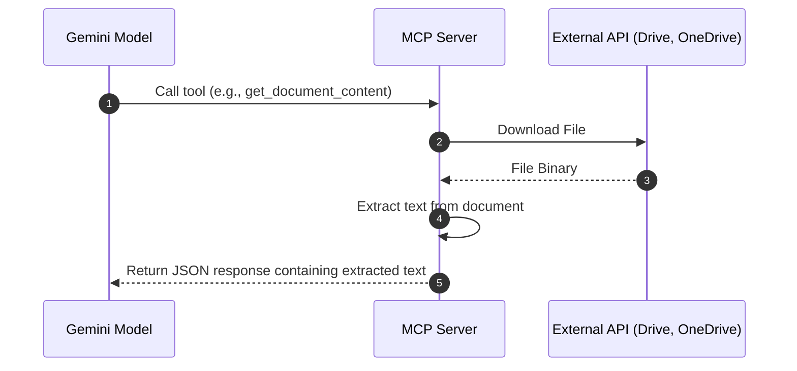
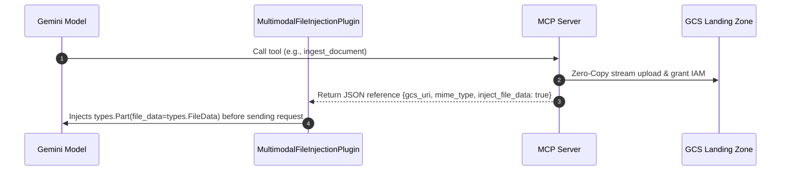

# MCP Data Ingestion & Transmission Methods

This document compares two distinct approaches for transmitting external file data (such as PDFs, docs, and sheets) from Model Context Protocol (MCP) servers to Gemini-based agents.

---

## 1. Transmission Architectures

### Method 1: Text-Only Extraction (Standard JSON-RPC)
The MCP server downloads the file, extracts the text content (via PDF parsing, OCR, etc.), and returns the raw text directly within the standard JSON-RPC tool response payload.

### Method 2: GCS Ingestion & Multimodal URI Injection (Zero-Copy)
The MCP server streams the file directly into a secure Cloud Storage (GCS) Landing Zone bucket and returns a lightweight metadata reference. A custom framework plugin intercepts this reference mid-turn and injects it as a native `FileData` object into the LLM request.

---

## 2. Advantages & Disadvantages

| Metric / Aspect | Method 1: Text-Only Extraction | Method 2: GCS & Multimodal URI Injection |
| :--- | :--- | :--- |
| **Data Fidelity** | ❌ **Poor**: Loses all visual/spatial layout, formatting, images, charts, and tables. |  **Perfect**: Gemini consumes the native PDF, preserving rich formatting, images, and spatial context. |
| **Payload Size** | ❌ **High Overhead**: Massive text blocks bloat the JSON-RPC messaging bus. Can trigger HTTP/RPC payload limits. |  **O(1) (Zero-Copy)**: Bypasses the messaging bus completely by returning a tiny URI payload. |
| **Memory Footprint** | ❌ **OOM Risk**: The orchestration middleware must load large text blocks or base64-encoded strings directly into memory. |  **Low / Safe**: Orchestrator never loads the file binary. The stream goes directly from MCP to GCS. |
| **Token Cost** |  **Lower**: Standard text consumption is generally cheaper in terms of token usage. | ❌ **Higher**: Native multimodal processing of pages consumes significantly more tokens per page. |
| **Infrastructure & Setup** |  **Minimal**: Requires no extra cloud storage or custom middleware plugins. Works out-of-the-box. | ❌ **Complex**: Requires a secure landing zone bucket, lifecycle policies, IAM binding, and a custom runtime plugin. |

---

## 3. Gemini Enterprise Compatibility

### Native Gemini in Gemini Enterprise (Workspace Side Panel / Apps)
* **Compatible with: Method 1 (Text-only) only.**
* **Why**: Standard Gemini Enterprise clients communicate with external tools via standard JSON-RPC. They only accept text/markdown payloads. They do not have built-in hooks to intercept a custom JSON schema (like `inject_file_data`), read from a GCS landing zone, and modify the outbound Vertex AI API requests to inject native `FileData` objects.

---

## 4. Requirements to Implement Method 2 (URI Injection)

To support **Method 2**, you cannot use native Gemini Enterprise tools alone. You must orchestrate the application using a custom framework like the **Vertex AI Agent Engine (ADK)**:

1. **GCS Landing Zone**:
   * A dedicated GCP bucket (e.g., `<project-id>-landing-zone`) to hold temporary files.
   * Object Lifecycle Management (OLM) rules to physically delete files automatically after 7 days.
2. **ADK Agent Runtime**:
   * The agent logic must be hosted on Vertex AI Reasoner Engine.
3. **Dependency Injection**:
   * A pre-tool execution hook to inject context (`app_name`, `user_id`, `session_id`) into the tool request so the MCP server uploads to a secure, compartmentalized path:
     `gs://{landing-zone}/{app_name}/{user_id}/{session_id}/{filename}`
4. **Multimodal File Injection Plugin**:
   * A plugin implementing the `before_model_callback` hook in the ADK agent.
   * This plugin scans tool outputs for the `inject_file_data: true` flag and appends a `types.Part(file_data=types.FileData(file_uri=..., mime_type=...))` structure into the active LLM request block.
