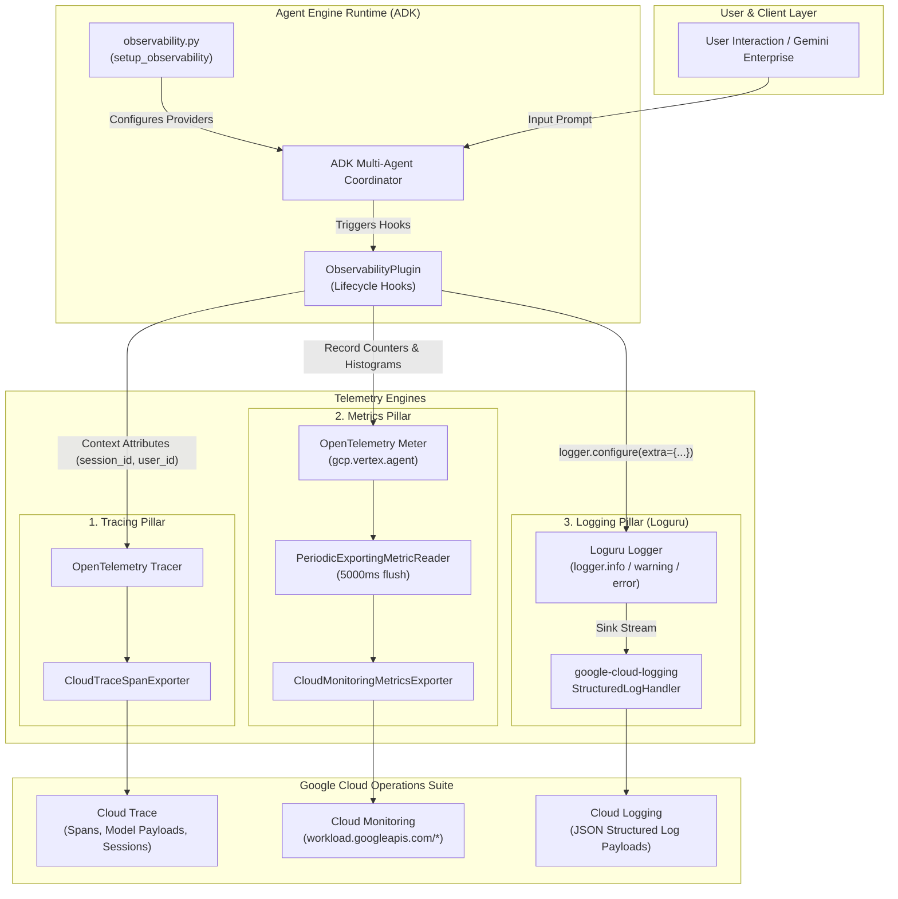
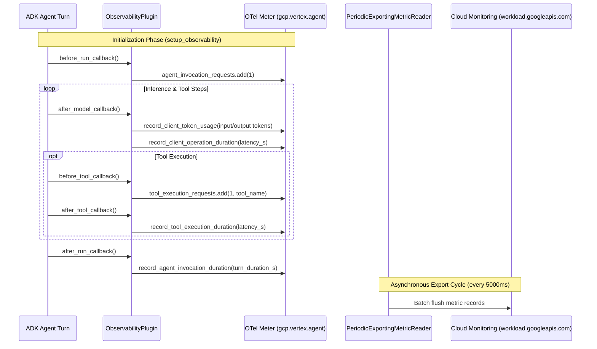
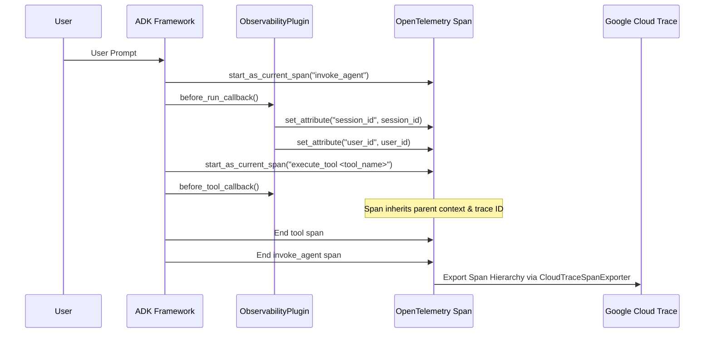
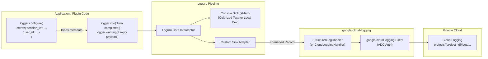

# GCP Telemetry Implementation Architecture

This document provides a comprehensive, diagrammatic architecture guide explaining the implementation requirements to dispatch **Metrics**, **Traces**, and **Structured Logs** from an ADK Agent running on **Vertex AI Agent Engine** into **Google Cloud Operations Suite** (Cloud Monitoring, Cloud Trace, and Cloud Logging), with special emphasis on the **Loguru** logging integration.

---

## 1. High-Level Telemetry Flow

The following architecture diagram illustrates how the three observability pillars are decoupled, instrumented, and dispatched into their dedicated GCP destinations:



---

## 2. Pillar 1: Metrics (Cloud Monitoring)

### Architecture & Lifecycle Sequence
ADK metrics capture quantitative performance, model token consumption, tool execution latencies, and operational counters.



### Implementation Checklist for Metrics
To send metrics directly to Cloud Monitoring:
1. **Initialize GCP Metric Exporter via ADK**:
   Use `google.adk.telemetry.google_cloud.get_gcp_exporters(project_id=PROJECT_ID, enable_cloud_metrics=True)`.
2. **Register Global OTel MeterProvider**:
   Call `google.adk.telemetry.setup.maybe_set_otel_providers([exporters])`. This sets the default OpenTelemetry `MeterProvider` configured with `PeriodicExportingMetricReader` (5-second flush interval).
3. **Pydantic Configuration (Avoiding Reserved Env Vars)**:
   In Vertex AI Agent Engine, the environment variable `GOOGLE_CLOUD_PROJECT` is strictly reserved by the platform. You must inject your project ID using a custom configuration setting (e.g., `GCP_CONFIG.PROJECT_ID` in `agent_settings.py`) rather than relying on `os.getenv("GOOGLE_CLOUD_PROJECT")`.
4. **Emit Standardized Semantic Conventions**:
   Emit metrics under the meter name `gcp.vertex.agent` using standard OpenTelemetry GenAI Semantic Conventions:
   - `gen_ai.client.token.usage` (Histogram)
   - `gen_ai.client.operation.duration` (Histogram)
   - `gen_ai.agent.invocation.duration` (Histogram)
   - `gen_ai.tool.execution.duration` (Histogram)
   - `gen_ai.agent.invocation.requests` (Counter)
   - `gen_ai.agent.invocation.errors` (Counter)
   - `gen_ai.tool.execution.requests` (Counter)
   - `gen_ai.tool.execution.errors` (Counter)

---

## 3. Pillar 2: Traces (Cloud Trace)

### Architecture & Context Propagation
Tracing tracks the full lifecycle of a user request across all agent hops and MCP tools, providing visualization in Google Cloud Trace.



### Implementation Checklist for Traces
1. **Tracer Setup**:
   `get_gcp_exporters()` automatically configures `CloudTraceSpanExporter` and registers the OTel `TracerProvider`.
2. **Context Enrichment**:
   In `before_run_callback()`, extract the active span using `opentelemetry.trace.get_current_span()` and attach custom queryable attributes:
   ```python
   current_span = get_current_span()
   if current_span.is_recording():
       current_span.set_attribute("session_id", session_id)
       if user_id:
           current_span.set_attribute("user_id", user_id)
   ```
3. **Payload Visibility**:
   Cloud Trace automatically links nested spans for model generation (`generate_content`) and tool execution (`execute_tool`), enabling multi-turn conversation drill-downs.

---

## 4. Pillar 3: Logging (Cloud Logging + Loguru Bridge)

### The Challenge
By default, standard Python libraries output logs via `logging.Logger`. However, modern Python services favor **Loguru** for structured formatting, clean exception handling, and simple contextual binding. 

Simply redirecting stdout to Cloud Logging produces flat strings rather than structured JSON entries with native severity levels, timestamps, and contextual labels.

### The Solution: Loguru to Cloud Logging Bridge



### Why `enable_cloud_logging=False` in `get_gcp_exporters`?
When invoking `get_gcp_exporters(enable_cloud_metrics=True, enable_cloud_logging=False)`:
1. **Prevents Duplicate Logs**: ADK's native `enable_cloud_logging=True` installs an OpenTelemetry LogRecordProcessor alongside the Python logging system. If you also configure `google-cloud-logging` with Loguru, every message is written twice to Cloud Logging.
2. **Eliminates Shutdown Threading Issues**: OpenTelemetry log exporters on background threads can experience race conditions during process shutdown on Agent Engine. Delegating application logging to `google.cloud.logging.handlers.StructuredLogHandler` via Loguru provides thread-safe, native structured logs.

### Implementation Pattern (`observability.py`)

Here is the exact pattern implemented in `agent/core_agent/observability.py`:

```python
import sys
from loguru import logger
from google.cloud import logging as cloud_logging
from google.cloud.logging.handlers import StructuredLogHandler
from google.adk.telemetry.google_cloud import get_gcp_exporters
from google.adk.telemetry.setup import maybe_set_otel_providers
from .config.agent_settings import GCP_CONFIG

def setup_observability(project_id: str | None = None) -> None:
    """Configures Cloud Logging, Cloud Trace, and Cloud Monitoring."""
    resolved_project_id = project_id or GCP_CONFIG.PROJECT_ID

    # 1. Setup OpenTelemetry (Traces + Metrics)
    gcp_exporters = get_gcp_exporters(
        project_id=resolved_project_id,
        enable_cloud_metrics=True,
        enable_cloud_logging=False,  # Managed separately via Loguru bridge
    )
    maybe_set_otel_providers([gcp_exporters])

    # 2. Bridge Loguru to Google Cloud Logging
    try:
        client = cloud_logging.Client(project=resolved_project_id)
        # Use StructuredLogHandler for optimal Cloud Logging JSON representation
        cloud_handler = StructuredLogHandler()
        
        # Reset Loguru sinks
        logger.remove()
        
        # Local console sink (colorized, human-readable)
        logger.add(
            sys.stderr,
            format="<green>{time:YYYY-MM-DD HH:mm:ss}</green> | <level>{level: <8}</level> | <cyan>{name}</cyan>:<cyan>{line}</cyan> - <level>{message}</level>",
            level="INFO",
        )
        
        # Cloud Logging structured sink
        logger.add(
            cloud_handler,
            format="{message}",
            level="INFO",
        )
    except Exception as exc:
        logger.warning(f"Could not initialize Google Cloud Logging handler: {exc}")
```

### Contextual Enrichment via `ObservabilityPlugin`
Inside `agent/core_agent/plugins/observability_plugin/plugin.py`, the `before_run_callback` binds contextual metadata so every downstream log line includes the `session_id` and `user_id`:

```python
logger.configure(extra={"session_id": session_id, "user_id": user_id})
logger.info(f"Agent Turn started for Session ID: {session_id}")
```

In Google Cloud Logging, these fields appear structured under `jsonPayload.extra.session_id` and `jsonPayload.extra.user_id`, allowing effortless filtering:
```text
jsonPayload.extra.session_id = "0711bb8a-d5ba-411a-8fb5-48ef1ee89083"
```

---

## 5. Architectural Summary & Verification Checklist

| Pillar | Mechanism | GCP Destination | Key Class / Library |
|---|---|---|---|
| **Traces** | OpenTelemetry Context Propagation | Cloud Trace | `CloudTraceSpanExporter` |
| **Metrics** | OpenTelemetry GenAI Semantic Conventions | Cloud Monitoring (`workload.googleapis.com/*`) | `CloudMonitoringMetricsExporter`, `PeriodicExportingMetricReader` |
| **Logs** | Loguru Bridge via `StructuredLogHandler` | Cloud Logging (`jsonPayload`) | `loguru`, `google.cloud.logging.StructuredLogHandler` |

### Post-Deployment Verification Steps in GCP Console
1. **Cloud Trace**: Navigate to *Trace > Trace Explorer*. Filter by root span `invoke_agent` and verify `session_id` and `user_id` attributes.
2. **Cloud Monitoring**: Navigate to *Monitoring > Metrics Explorer*. Select resource `Generic Node` or search for metric prefix `workload.googleapis.com/gen_ai.*` (e.g., `gen_ai.agent.invocation.duration`, `gen_ai.client.token.usage`).
3. **Cloud Logging**: Navigate to *Logging > Logs Explorer*. Query `jsonPayload.extra.session_id:*` to confirm structured log delivery from Loguru.
