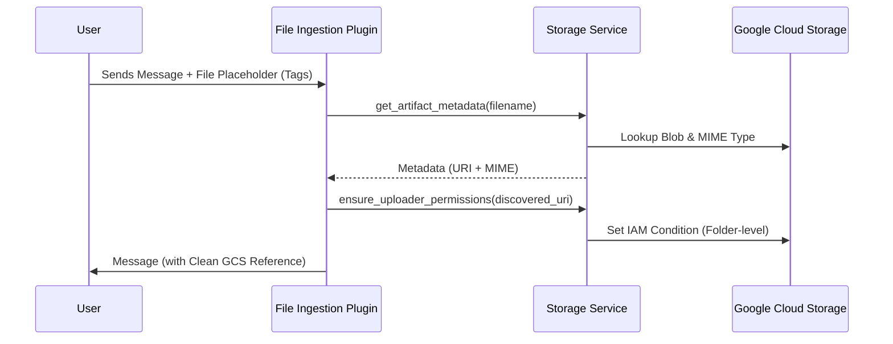

# Storage & Ingestion Architecture

This document explains the architecture of the artifact storage and ingestion pipeline for the Gemini Enterprise agent.

## Overview

The system is divided into two distinct layers to ensure a clean separation of concerns:
1.  **Storage Service Layer (The Tool)**: Provides the core capabilities to interact with GCS and IAM. It is a stateless utility that handles the "How".
2.  **Plugin Layer (The Hand)**: Orchestrates the agent's behavior by hooking into the lifecycle. It is the automated logic that handles the "When".

### The "Hand vs Tool" Analogy
Without the **Plugin**, the **Storage Service** would never be called. The Plugin is the "hand" that intercepts a user's upload and uses the Storage Service "tool" to persist and secure it.

---

## 1. Storage Service (`StorageService`)

Located at: `agent/core_agent/storage/service.py`

The `StorageService` is the "Source of Truth" for all GCS operations. It extends the base ADK `GcsArtifactService` with enterprise-specific features.

### Key Responsibilities:
- **Reference Management**: Instead of sending massive binary blobs in the model context, it returns `gs://` URI references. This keeps the prompt token-count low and improves performance.
- **MIME Type Safety**: Automatically resolves MIME types (falling back to `application/pdf` if unknown) to prevent Vertex AI ingestion errors.
- **Security Enforcement**: Implements the `ensure_uploader_permissions` method which manages identity-aware IAM bindings.

### Activation:
It is initialized at the application level in `app_builder.py` and is accessible via `invocation_context.artifact_service`.

---

## 2. Ingestion Plugins

Located at: `agent/core_agent/plugins/`

Plugins are responsible for "When" and "Where" data should be moved.

### A. File Ingestion Plugin (`GeminiEnterpriseFileIngestionPlugin`)
- **When it activates**: On the `on_user_message_callback`.
- **Function**: 
    - Intercepts messages from the user.
    - Extracts inline binary files or text-extraction blocks.
    - Uses the `StorageService` to save them to GCS.
    - Replaces the original binary data in the message with a lightweight GCS reference.

### B. Lazy Association & Discovery
- **The Problem**: In some environments (like Gemini Enterprise), files may be "pre-stashed" into the GCS bucket before the plugin intercepts the message, leaving behind empty text tags.
- **The Solution**: 
    - The `StorageService` provides a `get_artifact_metadata` method to "discover" these pre-stashed files.
    - The Plugin maintains a **Turn Registry** to link placeholders to actual GCS blobs, ensuring the agent always receives high-integrity GCS URIs even if the binary data was stripped during pre-processing.

### C. Rendering Callbacks (`render_pending_artifacts`)
- **When it activates**: At the end of an agent turn (before the response is sent).
- **Function**: 
    - Scans the session state for any artifacts queued for display.
    - Uses `StorageService.load_artifact_as_bytes()` to force a binary download (since the UI requires bytes for visual rendering).

---

## 3. Security Model: Identity-Aware IAM

To comply with Enterprise security standards, the agent uses **Uniform Bucket-Level Access (UBLA)** with **IAM Conditions**.

### Folder-Level Isolation:
Permissions are not granted per file. Instead, the agent grants access to a specific **user folder** using a CEL (Common Expression Language) condition:

```cel
resource.name.startsWith("projects/_/buckets/<BUCKET_NAME>/objects/<APP_NAME>/<USER_EMAIL>/")
```

### Benefits:
- **Privacy**: Users cannot list or access files belonging to other users.
- **Scalability**: Reduces IAM policy bloat by using one binding per user per app, rather than one per file.
- **Auditability**: Every file is stamped with `uploader: <email>` metadata.

## Workflow Diagram


