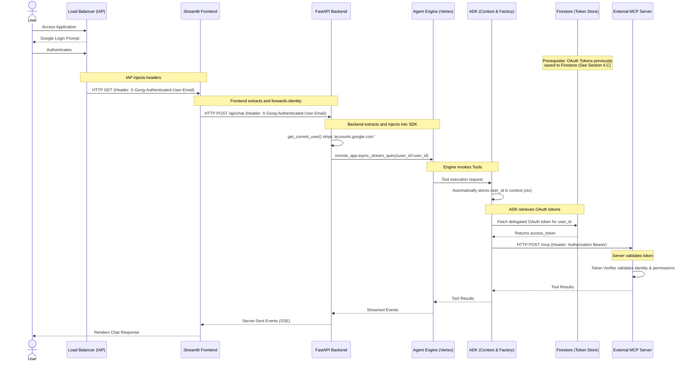
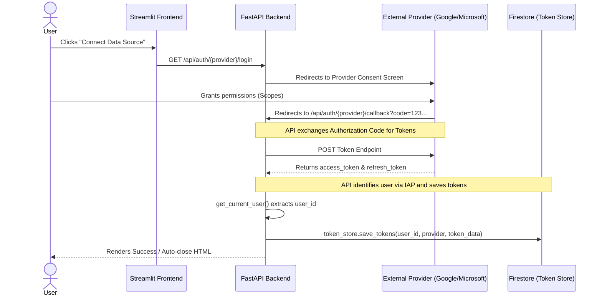

# Authentication Flow: Custom UI

This document details the security architecture and identity propagation flow for the Custom UI implementation (Streamlit + FastAPI), which interacts with the Agent Engine (ADK) and Model Context Protocol (MCP) servers.

## 1. Network Security Architecture (Zero Trust)

The architecture leverages an **Internal Application Load Balancer (ILB)** combined with **Identity-Aware Proxy (IAP)** to protect the application.

### The `allUsers` Myth in Cloud Run
It is a common misconception that granting `roles/run.invoker = ["allUsers"]` to a Cloud Run service makes it insecure. In our architecture, this is both required and completely safe.

1. **Native IAM vs IAP**: Cloud Run's native IAM expects a Google-issued OIDC token. However, when IAP is enabled, the authentication happens at the Load Balancer level. IAP validates the user but does not generate an OIDC token for the backend. Instead, according to the [official GCP documentation on Getting the user's identity with IAP](https://cloud.google.com/iap/docs/identity-howto?hl=en), it injects a signed JWT assertion (`X-Goog-IAP-JWT-Assertion`) and the user's email (`X-Goog-Authenticated-User-Email`) into the HTTP headers.
2. **Ingress Control (The Real Boundary)**: The Cloud Run instances (both frontend and backend) are configured with `ingress = "INGRESS_TRAFFIC_INTERNAL_LOAD_BALANCER"`. This means the Google Cloud network infrastructure physically blocks any direct requests (even if authenticated) that do not originate from the Load Balancer.
3. **Conclusion**: Since the Load Balancer enforces IAP (blocking unauthenticated users) and Cloud Run blocks anything bypassing the Load Balancer, the system is fully secured in a Zero Trust model, acting as a strict API Gateway.

---

## 2. Identity Flow (The Journey of the `user_id`)

The system relies on propagating the user's identity seamlessly from the browser all the way down to the Agent Engine and its MCP servers. 

### Architecture Diagram



---

## 3. Detailed Identity Propagation Steps

### Step 1: The Origin (IAP)
When a user accesses the application, IAP intercepts the request, forces Google Workspace/Cloud Identity authentication, and attaches the `X-Goog-Authenticated-User-Email` header (e.g., `accounts.google.com:user@domain.com`) to the request before forwarding it to the Streamlit Frontend.

### Step 2: The Frontend (Streamlit)
The Streamlit application utilizes the `st.context.headers` API to dynamically extract the identity header provided by IAP. 
```python
user_email = st.context.headers.get("X-Goog-Authenticated-User-Email", "mock-user@example.com")
headers = {
    "X-Goog-Authenticated-User-Email": user_email
}
```
When making API calls to the FastAPI backend, Streamlit explicitly attaches this `headers` dictionary to the outbound `requests.post()` calls. This ensures a seamless transition between local development (where it defaults to a mock user) and production (where IAP provides the real identity).

### Step 3: The Backend (FastAPI)
The FastAPI router relies on a dependency injection function (`get_current_user` in `oauth.py`). This function:
1. Reads the `X-Goog-Authenticated-User-Email` header.
2. Strips the `accounts.google.com:` prefix.
3. Returns a clean `user_id` string (e.g., `user@domain.com`).

### Step 4: Invoking Agent Engine (Vertex AI)
The most critical handoff occurs when the backend invokes the Agent Engine. The backend passes the clean `user_id` as an explicit argument to the SDK methods (e.g., `async_stream_query` or `create_session`).
```python
async for event in remote_app.async_stream_query(
    user_id=user_id,  # Injection happens here
    session_id=session_id,
    message=body.message,
):
```
Vertex AI Agent Engine receives this request and begins the reasoning process. When the LLM decides to use a tool, Agent Engine forwards the tool execution request to the ADK layer.

### Step 5: The ADK Context & Factory
Once the tool execution request is received, the ADK automatically manages and stores the `user_id` inside its execution context. Deep within the agent's architecture, components can blindly trust and consume this identity without knowing about the HTTP layers above:
* **Plugins (e.g., Multimodal File Injection)**: Extract the user ID during tool execution via `tool_context._invocation_context.session.user_id` to enforce IDOR checks and manage user-specific Google Cloud Storage landing zones.
* **MCP Factory**: Extracts the user ID via `ctx.user_id` to retrieve delegated OAuth tokens (from Google, Microsoft, Atlassian) from Firestore. It then injects these tokens into the `Authorization` header of the HTTP request destined for the external MCP Server.

### Step 6: External MCP Server Validation
The ADK fires the HTTP POST request to the remote MCP Server. The MCP Server receives the request and, before executing any logic, uses its internal `Token Verifier` to validate the incoming token. The MCP server is the ultimate authority that confirms the user's identity and ensures they have the proper authorization to perform the requested action.

## 4. The Two OAuth Clients Pattern (IAP vs OSIRIS)

When implementing IAP alongside an application that also consumes Google APIs on behalf of the user (like the OSIRIS AI Agent), the best architectural practice is to maintain **two separate OAuth 2.0 Client IDs**.

While it is technically possible to share one Client ID, separating them follows the principle of **Separation of Concerns**:

### A. The IAP OAuth Client (Perimeter Security / Authentication)
This client is strictly used by the Load Balancer to answer the question: *"Who are you?"*
* **Purpose**: Identity verification and access control to the network perimeter. It only requests basic scopes (email, profile).
* **Redirect URI**: According to the [official GCP documentation](https://cloud.google.com/iap/docs/authentication-howto), this must point to Google's IAP infrastructure using the exact format: `https://iap.googleapis.com/v1/oauth/clientIds/YOUR_CLIENT_ID:handleRedirect`.
* **Outcome**: IAP sets a session cookie in the browser and injects the `X-Goog-Authenticated-User-Email` header. **It does not provide API access tokens to the backend.**

### B. The OSIRIS OAuth Client (Data Delegation / Authorization)
This client is used by the backend application to answer the question: *"Do I have permission to read your Google Drive/Calendar to feed the AI Agent?"*
* **Purpose**: Requesting advanced scopes to act on behalf of the user.
* **Redirect URI**: Points to the custom UI backend (e.g., `https://<your-domain>/api/auth/google/callback`).
* **Outcome**: The backend receives an `access_token` and `refresh_token`, which are stored in Firestore (`token_store.py`). The MCP Servers use these tokens to securely extract data.

### Why Separate Them?
1. **Security Isolation (Blast Radius)**: If the IAP secret is compromised, the attacker only gains network access (which is still protected by the IAP login). If the OSIRIS secret is compromised, data extraction could be at risk. Separating them limits the blast radius.
2. **User Experience (UX)**: 
    * The IAP login is often completely transparent (if the user is already signed into Chrome/Workspace), acting as an invisible shield.
    * The OSIRIS login is an explicit, user-initiated action (clicking "Connect Google Drive") where the user is presented with a clear consent screen detailing exactly what data the AI will access.

### C. The Token Ingestion Flow (OAuth Callback)
While the Chat Execution flow (Section 2) *reads* tokens from Firestore, the actual ingestion of these tokens happens via a dedicated OAuth callback flow in the FastAPI backend.



1. **Initiation**: The user clicks a connect button in Streamlit, which hits the FastAPI login endpoint.
2. **Consent**: The user is redirected to the external OAuth provider (e.g., Google or Microsoft) and explicitly grants OSIRIS the requested scopes (e.g., Drive, Calendar).
3. **Callback & Exchange**: The provider redirects the user back to the FastAPI `/callback` endpoint with an authorization code. FastAPI exchanges this code for an `access_token` and a long-lived `refresh_token`.
4. **Storage**: The FastAPI router uses `get_current_user()` to read the `X-Goog-Authenticated-User-Email` header (injected by IAP). It then calls `token_store.save_tokens(user_id, provider, token_data)` to securely persist the tokens in **Firestore**, keyed uniquely by the user's identity.

## 5. Session Management & Conversational Memory (Zero-Overhead History)

To maintain context across chat interactions without continuously re-transmitting the entire conversation history over the network, the Custom UI implements a highly efficient session management flow using Server-Sent Events (SSE) and Vertex AI's native memory.

### The Session Lifecycle

1. **Session Creation (Backend / Vertex AI)**:
   When a user sends their first message, the frontend payload has an empty `session_id`. The FastAPI backend detects this and invokes the ADK to create a native session directly in Google Cloud (Vertex AI).
   ```python
   remote_session = await remote_app.async_create_session(user_id=user_id)
   session_id = remote_session["id"]
   ```
   *Benefit*: The conversational history lives securely in the Cloud, not in the local container or the user's browser.

2. **First-Chunk SSE Transmission**:
   Because the backend uses a Streaming API (`StreamingResponse`), it cannot return the new `session_id` in a standard JSON response. Instead, it injects a custom event as the very first chunk of the stream:
   ```python
   yield f"data: {json.dumps({'type': 'session_info', 'session_id': session_id})}\n\n"
   ```

3. **Frontend Caching (Streamlit)**:
   As the Streamlit frontend iterates over the incoming SSE stream, it parses the events. When it detects the `session_info` event, it caches the ID in the browser's session state:
   ```python
   elif event_type == "session_info":
       st.session_state.session_id = event_data.get("session_id")
   ```

4. **Subsequent Requests (Zero-Overhead)**:
   On the next user message, Streamlit attaches the cached `session_id` to the payload. The backend skips session creation and simply tells Vertex AI to append the new message to the existing session. This allows the Agent Engine to seamlessly "remember" the context without the frontend needing to upload the chat history array in every HTTP request.
