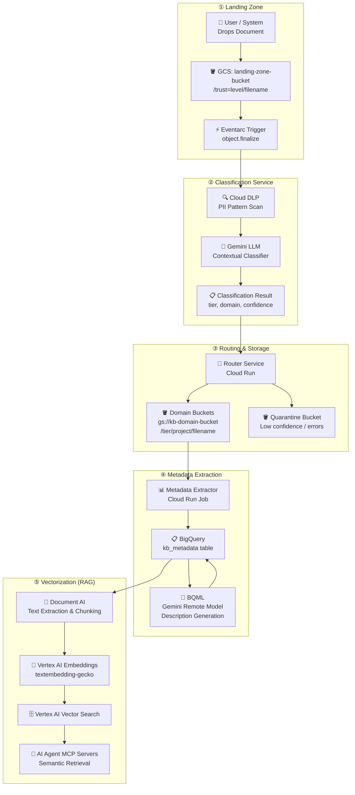

# Enterprise Knowledge Base — Pipeline Architecture Design

> **Status:** Draft — Approved by Architecture / Data Engineering Team  
> **Version:** 1.0  
> **Last Updated:** 2026-03-30  
> **Owner:** Data Engineering Team  

---

## 1. Overview & Goals

The **Enterprise Knowledge Base (EKB)** is a fully automated, event-driven data pipeline designed to:

1. **Ingest** documents (PDF, Word, GDoc) via a shared GCS landing zone.
2. **Classify** documents using a hybrid **Cloud DLP + Gemini LLM** approach to determine sensitivity levels and business domains.
3. **Route** documents to domain-specific, access-controlled GCS buckets.
4. **Extract** structured metadata into BigQuery for structured searching.
5. **AI Enrichment**: Use BQML (BigQuery ML) to generate concise document descriptions.
6. **Vectorization**: Index content into **Vertex AI Vector Search** for semantic retrieval by AI Agent MCP Servers.

---

## 2. High-Level Architecture



---

## 3. Trust level system

Every document uploaded must have a **Trust Level** metadata tag to denote its maturity:

| Level | Key | Description |
|---|---|---|
| **Official** | `official` | Formally reviewed and approved content. |
| **In Development** | `in_development` | Drafts and work-in-progress documents. |
| **Unofficial** | `unofficial` | Informal notes, raw data, or personal exports. |

> **Implementation:** Stored in GCS custom metadata as `x-goog-meta-trust-level`.

---

## 4. AI Document Classification Matrix

This matrix is used by the LLM classifier (Phase 2) to tag documents for routing and access control.

| Level | Risk | Definition | Detection Rules |
|---|---|---|---|
| **1 — Public** | None | Approved for external release. | Markers like "Public", "Press Release". Tone is external-facing. |
| **2 — Internal Use Only** | Low | Internal operations; not for public. | Internal email lists, "All Hands", "SOP", "Internal Only" keywords. |
| **3 — Client Confidential** | High | Pertains to specific clients (NDAs). | Mentions external company + delivery terms (SOW, Milestone). Contractual language. |
| **4 — Confidential** | High | Sensitive internal strategy/proprietary. | "Confidential", "Proprietary", project codenames. Roadmaps, financial forecasts. |
| **5 — Strictly Confidential** | Critical | Need-to-know basis (catastrophic risk). | **Phase 1 (DLP):** SSN, Credit Card, IBAN, Passwords. **Phase 2 (LLM):** PIP, Termination, Severance, M&A due diligence. |

---

## 5. Domain Storage Hierarchy

Documents are routed to domain-specific buckets with the following internal structure:

**Domain Buckets:**
- `gs://kb-it-bucket/`
- `gs://kb-finance-bucket/`
- `gs://kb-hr-bucket/`
- `gs://kb-sales-bucket/`
- `gs://kb-executives-bucket/`
- `gs://kb-legal-bucket/`
- `gs://kb-operations-bucket/`

**Folder Structure within each bucket:**
```
/{tier}/
  {project_name}/
    {filename}
```
*Example: `gs://kb-it-bucket/confidential/project-alpha/architecture.pdf`*

---

## 6. BigQuery Metadata Schema (`kb_metadata`)

| Field | Type | Description |
|---|---|---|
| `document_id` | `STRING` | UUID (Primary Key) |
| `gcs_uri` | `STRING` | Final routed path in domain bucket |
| `source_uri` | `STRING` | Original landing zone path |
| `filename` | `STRING` | Original filename |
| `classification_tier` | `STRING` | Result from classification matrix |
| `domain` | `STRING` | it, hr, sales, etc. |
| `confidence_score` | `FLOAT64` | AI classifier confidence (0.0 - 1.0) |
| `trust_level` | `STRING` | official, in_development, unofficial |
| `project` | `STRING` | Project identifier |
| `uploader_email` | `STRING` | Email of the contributor |
| `creator_name` | `STRING` | Extracted doc property |
| `ingested_at` | `TIMESTAMP` | Time arrived in landing zone |
| `routed_at` | `TIMESTAMP` | Time moved to domain bucket |
| `description` | `STRING` | **AI Summary (Generated via BQML)** |
| `vectorization_status`| `STRING` | pending, completed, failed |

---

## 7. Vector Database Payload (Vertex AI Vector Search)

Each chunk index carries a rich metadata payload for grounding responses:

```json
{
  "id": "doc_uuid_chunk_001",
  "embedding": [0.012, -0.83, ...],
  "metadata": {
    "document_id": "doc_uuid",
    "filename": "file.pdf",
    "domain": "it",
    "tier": "confidential",
    "trust_level": "official",
    "project": "alpha",
    "description": "Short AI-generated summary...",
    "chunk_text": "The actual text context of this segment..."
  }
}
```

---

## 8. Google Cloud Services — Selection & Justification

| Step | Service | Justification |
|---|---|---|
| **Trigger** | **Eventarc** | Decoupled eventing. Supports object finalization events with low latency. |
| **Compute** | **Cloud Run** | Handles bursty traffic, supports longer timeouts than Functions, and allows for large libraries (DLP, Gemini client). |
| **PII Detection**| **Cloud DLP** | Hardened, enterprise-grade PII detection. Essential for "Strictly Confidential" short-circuiting. |
| **Classifer** | **Gemini Pro (Vertex AI)** | State-of-the-art context window and reasoning. Native integration with GCP IAM and security. |
| **Metadata** | **BigQuery** | Highly scalable for structured search. BQML integration is key for cost-effective description generation. |
| **Enrichment** | **BQML** | Allows running ML models (Gemini) directly on BigQuery rows without writing custom extraction scripts for summaries. |
| **Extraction** | **Document AI** | Best-in-class layout-aware extraction for PDF/Word documents. |
| **Vector DB** | **Vertex AI Vector Search** | Serverless, highly performant scaling, part of the unified Vertex AI platform for RAG. |

---

## 9. Next Steps

1. **Phase 1 Implementation**: Setup Landing Zone and Eventarc trigger.
2. **Phase 2 Implementation**: Build Cloud Run "Classifier" service (DLP + Gemini).
3. **Phase 3 Implementation**: Build Metadata Extractor and BQML enrichment jobs.
4. **Phase 4 Implementation**: Vectorization RAG pipeline.
