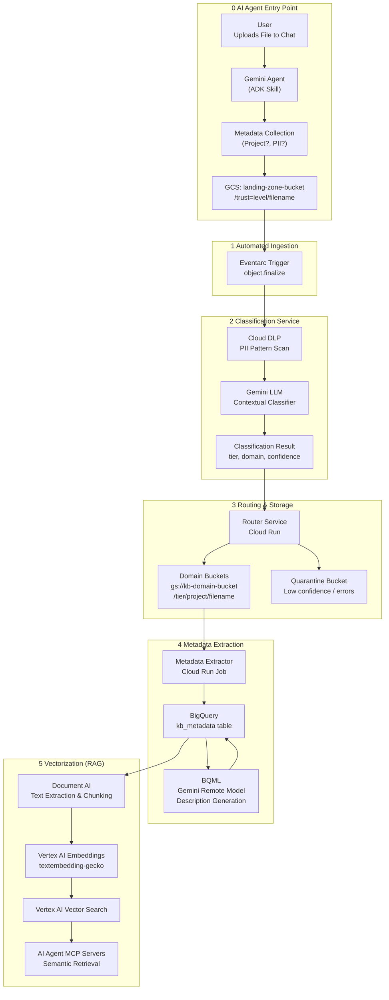

# Enterprise Knowledge Base — Pipeline Architecture Design

> **Status:** Draft — Approved by Architecture / Data Engineering Team  
> **Version:** 1.0  
> **Last Updated:** 2026-03-30  
> **Owner:** Data Engineering Team  

---

## 1. Overview & Goals

The **Enterprise Knowledge Base (EKB)** is a fully automated, event-driven data pipeline designed to:

1. **Ingest**: Direct user interaction via **Gemini Enterprise AI Agent**. The user uploads a file and provides metadata (Project, PII status) to an **ADK-powered Skill**.
2. **Handoff**: The Agent writes to the shared GCS landing zone with enriched metadata.
3. **Classify**: Automated document vetting via **Cloud DLP + Gemini LLM** (overriding user claims if necessary).
4. **Route**: Document is moved to domain-specific, access-controlled GCS buckets.
5. **Extract**: Structured metadata lands in BigQuery for searching.
6. **Enrich**: BQML-powered summary generation.
7. **Vectorize**: Semantic indexing via Vertex AI Vector Search.

---

## 2. High-Level Architecture



---

## 3. Step 0: Agent-Driven Ingestion (Human-in-the-Loop)

The primary entry point for documents is a direct interaction with the **Enterprise AI Agent** in chat.

### Ingestion Flow:
1.  **File Upload**: User attaches a PDF/Docx to the chat.
2.  **Skill Activation**: The Agent triggers the **`Ingestion Metadata Skill` (ADK-based)**.
3.  **Questionnaire**: The Agent dynamically asks for:
    - **Project ID**: Which team or project owns this document? (**Note**: The Skill must perform a **Similarity Check** against existing BigQuery metadata to suggest existing project names and prevent duplicates like `ProjectAlpha` vs `Project-Alpha`).
    - **PII Intent**: "Does this document contain sensitive PII (SSNs, CCs)?" (Optional pre-classification).
    - **Trust Maturity**: Is this a **Published** document or a **WIP** draft?
4.  **GCS Handoff**: The Agent writes the file to the Landing Zone, mapping conversation slots to object metadata (`x-goog-meta-project`, etc.).

> [!IMPORTANT]
> **Safety Overrider**: While the user can declare "No PII", the downstream **Cloud DLP (Phase 1)** always performs a deterministic scan and will override the user's claim if sensitive data is found.

---

## 4. Trust level system

Every document uploaded must have a **Trust Level** metadata tag to denote its maturity:

| Level | Key | Description |
|---|---|---|
| **Published** | `published` | Reviewed, approved, and formally published content. |
| **WIP** | `wip` | Working drafts under active development. |
| **Archived** | `archived` | Historical context; potentially outdated. |

> **Implementation:** Stored in GCS custom metadata as `x-goog-meta-trust-level`.

---

## 5. AI Document Classification Matrix

This matrix is used by the LLM classifier (Phase 2) to tag documents for routing and access control.

| Level | Risk | Definition | Detection Rules |
|---|---|---|---|
| **1 — Public** | None | Approved for external release. | Markers like "Public", "Press Release". Tone is external-facing. |
| **2 — Internal Use Only** | Low | Internal operations; not for public. | Internal email lists, "All Hands", "SOP", "Internal Only" keywords. |
| **3 — Client Confidential** | High | Pertains to specific clients (NDAs). | Mentions external company + delivery terms (SOW, Milestone). Contractual language. |
| **4 — Confidential** | High | Sensitive internal strategy/proprietary. | "Confidential", "Proprietary", project codenames. Roadmaps, financial forecasts. |
| **5 — Strictly Confidential** | Critical | Need-to-know basis (catastrophic risk). | **Phase 1 (DLP):** SSN, Credit Card, IBAN, Passwords. **Phase 2 (LLM):** PIP, Termination, Severance, M&A due diligence. |

---

## 6. Domain Storage Hierarchy

Documents are routed to domain-specific buckets with the following internal structure:

**Domain Buckets:**
- `gs://kb-it-bucket/`
- `gs://kb-finance-bucket/`
- `gs://kb-hr-bucket/`
- `gs://kb-sales-bucket/`
- `gs://kb-executives-bucket/`
- `gs://kb-legal-bucket/`
- `gs://kb-operations-bucket/`

**Folder Structure within each bucket:**
```
/{tier}/
  {project_name}/
    {uploader_email_prefix}/
      {filename}
```
*Example: `gs://kb-it-bucket/confidential/project-alpha/maria.gutierrez/architecture.pdf`*

### Security Rationale: IAM Condition Prefixing
To enforce fine-grained security at the object level, the pipeline relies on **GCS IAM Conditions** with the `.startsWith()` operator.
- **Why Tier First?**: IAM Conditions do not support wildcards (e.g., `*/strictly-confidential/*`). By placing the `{tier}` at the **root prefix**, we can grant classification-based access (e.g., "The Security Group can view all `strictly-confidential` data across all projects") using a single, scalable condition.
- **Ownership Boundary**: Placing `{uploader_email_prefix}` in the path satisfies the **ADR-001** requirement for user-level authorization boundaries, allowing for per-user access policies if needed.
- **Uniform Bucket-Level Access (UBLA)**: This architecture **requires** UBLA to be enabled to bypass ACL legacy overrides.

---

## 7. BigQuery Metadata Schema (`kb_metadata`)

| Field | Type | Description |
|---|---|---|
| `document_id` | `STRING` | UUID (Primary Key) |
| `gcs_uri` | `STRING` | Final routed path in domain bucket |
| `source_uri` | `STRING` | Original landing zone path |
| `filename` | `STRING` | Original filename |
| `classification_tier` | `STRING` | Result from classification matrix |
| `domain` | `STRING` | it, hr, sales, etc. |
| `confidence_score` | `FLOAT64` | AI classifier confidence (0.0 - 1.0) |
| `trust_level` | `STRING` | published, wip, archived |
| `project` | `STRING` | Project identifier |
| `uploader_email` | `STRING` | Email of the contributor |
| `creator_name` | `STRING` | Extracted doc property |
| `ingested_at` | `TIMESTAMP` | Time arrived in landing zone |
| `routed_at` | `TIMESTAMP` | Time moved to domain bucket |
| `description` | `STRING` | **AI Summary (Generated via BQML)** |
| `vectorization_status`| `STRING` | pending, completed, failed |

### 7.1 Performance & Cost Optimization (Partitioning & Clustering)

To maximize query efficiency and reduce BigQuery analysis costs (GCP Slot usage), the `kb_metadata` table is configured as follows:

- **Partitioning**: Day-partitioned by `ingested_at`. This allows for efficient time-series analysis and "hot data" filtering.
- **Clustering**: Multi-column clustering by `domain`, `project`, `classification_tier`, `uploader_email`.

**Benefits**:
1. **Cost Savings**: BigQuery only scans data segments that match the filters (e.g., `WHERE project = 'alpha'`), significantly reducing the amount of bytes processed.
2. **Speed**: Dramatically faster retrieval for RAG-anchored queries that filter by team or security tier.
3. **Audit Readiness**: Queries for a specific user's activity (`uploader_email`) are highly optimized.

---

## 8. Vector Database Payload (Vertex AI Vector Search)

Each chunk index carries a rich metadata payload for grounding responses:

```json
{
  "id": "doc_uuid_chunk_001",
  "embedding": [0.012, -0.83, ...],
  "metadata": {
    "document_id": "doc_uuid",
    "filename": "file.pdf",
    "domain": "it",
    "tier": "confidential",
    "trust_level": "published",
    "project": "alpha",
    "description": "Short AI-generated summary...",
    "chunk_text": "The actual text context of this segment..."
  }
}
```

---

## 9. Google Cloud Services — Selection & Justification

| Step | Service | Justification |
|---|---|---|
| **Entry Point** | **Gemini Enterprise Agent** | Direct human interface for ingestion in Chat. |
| **Ingestion Logic** | **ADK (Skill Framework)** | Simplifies the bridge between user intent (metadata collection) and GCS storage. |
| **Compute Engine** | **Agent Engine** | Secure environment for running ADK-powered Skills. |
| **Trigger** | **Eventarc** | Decoupled eventing. Supports object finalization events with low latency. |
| **Compute** | **Cloud Run** | Handles bursty traffic, supports longer timeouts than Functions, and allows for large libraries (DLP, Gemini client). |
| **PII Detection**| **Cloud DLP** | Hardened, enterprise-grade PII detection. Essential for "Strictly Confidential" short-circuiting. |
| **Classifer** | **Gemini Pro (Vertex AI)** | State-of-the-art context window and reasoning. Native integration with GCP IAM and security. |
| **Metadata** | **BigQuery** | Highly scalable for structured search. BQML integration is key for cost-effective description generation. |
| **Enrichment** | **BQML** | Allows running ML models (Gemini) directly on BigQuery rows without writing custom extraction scripts for summaries. |
| **Extraction** | **Document AI** | Best-in-class layout-aware extraction for PDF/Word documents. |
| **Vector DB** | **Vertex AI Vector Search** | Serverless, highly performant scaling, part of the unified Vertex AI platform for RAG. |

---

## 10. Data Privacy & ADR-001 Alignment

The EKB pipeline is built to strictly adhere to **[ADR-001: Data Privacy Strategy](https://github.com/eamadorm-endava/Research-Agent/blob/main/docs/ADRs/001-Data-Privacy-Strategy.md)**.

- **Preserve-and-Protect**: As per ADR-001, we prioritize **AI accuracy over masking**. We store the **full, unmasked text** but protect it with multiple security layers (CMEK, IAM Conditions, VPC-SC).
- **Encryption at Rest (CMEK)**: All GCS Buckets and BigQuery Datasets used by the pipeline **must** be encrypted with Customer-Managed Encryption Keys (**KMS**).
- **Context Preservation**: Cloud DLP is used for **tagging** and **Short-Circuiting** high-risk data (PII Detection), but it does not permanently redact original sources unless explicitly requested.

---

## 11. Next Steps

1. **Phase 0 (Infrastructure)**: Provision Cloud KMS Keys, GCS Buckets (with CMEK), and BigQuery Datasets.
2. **Phase 1 Implementation**: Setup Landing Zone and Eventarc trigger.
3. **Phase 2 Implementation**: Build Cloud Run "Classifier" service (DLP + Gemini).
4. **Phase 3 Implementation**: Build Metadata Extractor and BQML enrichment jobs.
5. **Phase 4 Implementation**: Vectorization RAG pipeline.
