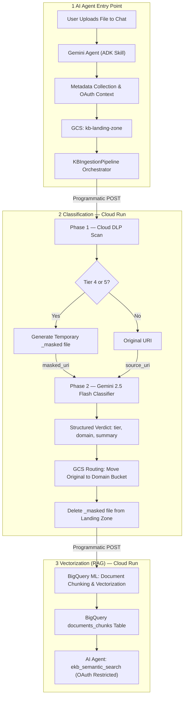

# Enterprise Knowledge Base — Pipeline Architecture Design

> **Status:** Final Design Approved  
> **Version:** 3.0  
> **Last Updated:** 2026-04-15  
> **Owner:** Data Engineering Team  
> **Standards Alignment:** ISO/IEC 27001:2022 (Controls 5.12, 5.13), NIST SP 800-53 Rev5 (AC-16, RA-2, SI-12), NIST SP 800-171 Rev3 (§3.1, §3.13), NIST SP 800-60 Vol 1–2  

---

## 1. Overview & Goals

The **Enterprise Knowledge Base (EKB)** is an agent-orchestrated and event-driven data pipeline designed to:

1. **Ingestion**: Direct user interaction via **Gemini Enterprise AI Agent**. The user uploads a file and provides metadata (Project, PII status, Versioning) to an **ADK-powered Skill**.
2. **Handoff**: The Agent writes to the shared GCS landing zone with enriched custom metadata using the user's **OAuth context**.
3. **Classify**: The Agent orquestrator (**`KBIngestionPipeline`**) triggers the classification service.
4. **Route**: Document is moved to domain-specific, access-controlled GCS buckets based on the classification result.
5. **Extract**: Structured metadata lands in BigQuery for searching.
6. **Vectorize (RAG)**: The orchestrator triggers the RAG pipeline **programmatically** after successful routing, bypassing event-based triggers for better latency and control.

---

## 2. High-Level Architecture



---

## 3. Step 0: Agent-Driven Ingestion (Human-in-the-Loop)

The primary entry point for documents is a direct interaction with the **Enterprise AI Agent** in chat.

### Ingestion Flow:
1.  **File Upload**: User attaches a PDF/Docx to the chat.
2.  **Skill Activation**: The Agent triggers the **`Ingestion Metadata Skill` (ADK-based)**.
3.  **Questionnaire**: The Agent dynamically asks for:
    - **Project Name (Project ID)**: The primary identifier for grouping. (Note: The Skill must perform a **Similarity Check** against `knowledge_base.projects_config` to prevent duplicates). 
    - **Versioning**: Is this document a new version of an existing file?
    - **PII Intent**: "Does this document contain sensitive PII (SSNs, CCs)?" (Optional pre-classification).
    - **Trust Maturity**: Is this a **Published** document or a **WIP** draft?
4.  **GCS Handoff**: The Agent writes the file to the Landing Zone, mapping conversation slots to object metadata (`x-goog-meta-project`, etc.).
5.  **Pipeline Trigger**: Once the upload is confirmed, the Agent makes a direct API call to the Classification Cloud Run service, initiating the processing and securing the URI.

> [!IMPORTANT]
> **Safety Overrider**: While the user can declare "No PII", the downstream **Cloud DLP (Phase 1)** always performs a deterministic scan and will override the user's claim if sensitive data is found.

---

## 4. Trust level system

Every document uploaded must have a **Trust Level** metadata tag to denote its maturity:

| Level | Key | Description |
|---|---|---|
| **Published** | `published` | Reviewed, approved, and formally published content. |
| **WIP** | `wip` | Working drafts under active development. |
| **Archived** | `archived` | Historical context; potentially outdated. |

> **Implementation:** Stored in GCS custom metadata as `x-goog-meta-trust-level`.

---

## 5. AI Document Classification Matrix

The classification system is aligned with **[ISO/IEC 27001:2022](https://www.iso.org/standard/27001)** (Controls 5.12 *Information Classification* and 5.13 *Labelling of Information*), **[NIST SP 800-53 Rev5](https://csrc.nist.gov/pubs/sp/800/53/r5/upd1/final)** (AC-16 *Security Attributes*, RA-2 *Security Categorization*, SI-12 *Information Management and Retention*), **[NIST SP 800-171 Rev3](https://csrc.nist.gov/pubs/sp/800/171/r3/final)** (CUI handling requirements), and **[NIST SP 800-60 Vol 1](https://csrc.nist.gov/pubs/sp/800/60/v1r1/final) & [Vol 2](https://csrc.nist.gov/pubs/sp/800/60/v2r1/final)** (information type impact mapping).

### 5.1 Classification Philosophy

**[ISO/IEC 27001:2022](https://www.iso.org/standard/27001)** ([Control 5.12](https://www.iso.org/standard/75652.html)) requires organizations to define a classification scheme proportional to their risk posture, categorizing information by **business value, sensitivity, legal obligations, and the potential impact of unauthorized disclosure**. 

*(Standard mappings to FIPS 199 and NIST SP 800-171 CUI controls remain fully enforced per architectural standards).*

### 5.2 Dual-Phase Classification Engine

Document classification is performed in **two sequential phases**:

| Phase | Engine | Approach | Output |
|---|---|---|---|
| **Phase 1 — Deterministic** | Cloud DLP | Pattern-matching via built-in and custom InfoTypes | Tier verdict (4 or 5), DLP findings, masked_uri (when applicable) |
| **Phase 2 — Probabilistic** | Gemini 2.5 Flash (Multimodal GCS) | Business context reasoning over document content | Final tier (1–5), domain, document summary, confidence score |

**Phase 1 (DLP)** is the authoritative security gate:
- Scans the document for hard PII, credentials, and strategic markers.
- If Tier 4 or Tier 5 content is found, **masking is executed before Phase 2 runs**.
- Phase 2 always receives the safest available URI (masked if applicable, original if not).

**Phase 2 (Gemini)** provides contextual intelligence:
- Reads the document via native multimodal GCS access.
- Produces **tier, domain selection, document summary**, and **confidence score** as structured outputs.

> [!IMPORTANT]
> **Masking Requirement (Issue #107):** For **Tier 4** and **Tier 5** documents, Cloud DLP **must** execute a de-identification transformation. The masked document is stored in GCS with a `_masked` suffix. The pipeline returns the **URI of the masked document** (`masked_gcs_uri`) for all downstream processing.


### 5.3 Classification Matrix

| Tier | Label | FIPS 199 Impact | ISO 27001:2022 Analogue | Risk Level | Definition & Rationale | Standards Alignment | Phase 1 — DLP InfoTypes (Deterministic) | Phase 2 — Gemini Signals (Probabilistic) | Masking |
|---|---|---|---|---|---|---|---|---|---|
| **1** | **Public** | Low | *Public* | 🟢 None | Information **approved for external release**. Unauthorized disclosure causes no measurable organizational harm. Examples: press releases, marketing collateral, published documentation, open-source code. | **ISO 27001 §5.12**: Lowest label — no confidentiality controls required. Classification exists only to confirm intentional public release. **NIST SP 800-53 AC-16**: Security attribute = public. **FIPS 199**: Low confidentiality impact. | None required. DLP runs in scan-only mode. Detection of public markers: Custom `KEYWORD` — *"For Public Release"*, *"Press Release"*, *"Public Statement"*. No sensitive InfoTypes present. | Tone is outward-facing. No client/internal jargon, proprietary references, or internal identifiers. Phase 2 confirms absence of all higher-tier signals. Assigns Tier 1 only when no ambiguity exists. | None |
| **2** | **Internal Use Only** | Low | *Internal* | 🟡 Low | Information intended **exclusively for internal employees**. Unauthorized disclosure causes limited reputational harm but no legal or compliance violation. Examples: all-hands presentations, internal SOPs, onboarding guides, corporate wikis, internal newsletters. | **ISO 27001 §5.12**: *"Internal"* label. Requires basic access controls (authenticated users only) but no encryption mandate. **NIST SP 800-53 RA-2**: Low-impact information type. **NIST SP 800-60**: Mission/business process support information with Low confidentiality impact. | Custom `KEYWORD` — *"Internal Only"*, *"Not for External Distribution"*, *"All Hands"*, *"Company Confidential — Internal"*, company intranet domain names. No PII or financial InfoTypes. | Detects internal distribution lists, org chart references, SOP/policy language, and internal project names. Confirms document is internal-facing. Rejects upgrade to Tier 3+ unless client/strategic signals are found. | None |
| **3** | **Client Confidential** | Moderate | *Confidential* | 🟠 Moderate–High | Information pertaining to **specific named clients under contractual obligation (NDA, MSA, SOW)**. Unauthorized disclosure constitutes a breach of contract and creates legal liability. Examples: client SOWs, engagement letters, project deliverables marked Confidential, client-specific architecture diagrams, delivery milestones. | **ISO 27001 §5.12**: *"Confidential"* label. Requires access controls limited to named individuals/groups + audit logging. **NIST SP 800-171 §3.1**: CUI handling — data shared with a third party under agreement requiring protection. **NIST SP 800-53 AC-16**: Moderate security attributes for controlled data. **FIPS 199**: Moderate confidentiality impact. | Custom `KEYWORD` — *"Statement of Work"*, *"NDA"*, *"Non-Disclosure"*, *"Milestone"*, *"Deliverable"*, *"Engagement Letter"*, *"MSA"*. Known client name dictionary (extensible). Person names co-occurring with external company names. | Detects named client entities, contractual language, financial amounts tied to deliverables, and third-party identity references. Assigns Tier 3 when client scope is clear but no hard PII or strategic IP is present. Can upgrade to Tier 4 if strategic roadmap context is detected alongside client content. | None |
| **4** | **Confidential** | High | *Restricted* | 🔴 High | Sensitive **internal strategic and proprietary information**. Unauthorized disclosure could cause significant competitive harm, financial loss, or regulatory violation. Examples: product roadmaps, internal M&A strategy (early stage), Q-plan financial forecasts, proprietary algorithms, partner agreements, OKR targets, pricing models. | **ISO 27001 §5.12**: *"Restricted"* (or upper-confidential) label — strictest access controls enforced by role and need-to-know. **NIST SP 800-53 RA-2**: High-impact confidentiality. **NIST SP 800-171 §3.13**: CUI — restricted access, encrypted transmission, and audit logging required. **NIST SP 800-53 SI-12**: Information retention and protection obligations. **FIPS 199**: High confidentiality impact. | Built-in: `DATE` + `MONEY` in proximity (financial forecast pattern). Custom `KEYWORD` — *"Confidential"*, *"Proprietary"*, *"Under NDA"*, *"Roadmap"*, *"OKR"*, *"EBITDA"*, *"Q1 Target"*, *"Q2 Target"*, *"Q3 Target"*, *"Q4 Target"*, project codenames. `ORGANIZATION_NAME` in strategic planning context. | Detects strategic framing: business strategy language, proprietary methodology, financial projection context, competitive intelligence. Upgrades from Tier 3 when multiple strategic signals co-occur. Downgrades to Tier 3 if content is client-only with no internal IP. | **YES** — DLP de-identifies, stores `<filename>_masked.<ext>` in GCS, returns `masked_gcs_uri` |
| **5** | **Strictly Confidential** | High | *Strictly Confidential* | 🔴🔴 Critical | **Need-to-know basis only.** Unauthorized disclosure causes catastrophic harm: severe legal liability (GDPR, CCPA, HIPAA), individual harm, or existential organizational risk. Examples: HR records with PII, employee PIPs/termination agreements, severance packages, M&A due diligence files, financial data with government identifiers, system credentials. | **ISO 27001 §5.12**: Highest classification level — equivalent to *"Strictly Confidential"*. Maximum security controls: CMEK, MFA, strict IAM, VPC-SC. **NIST SP 800-53 AC-16 + SI-12**: Maximum security attribute enforcement and retention controls. **NIST SP 800-171 §3.1 + §3.13**: CUI-Specified — most sensitive categories: HR (Privacy CUI), Legal, Financial. **GDPR Art. 9 / CCPA §1798.100**: Personal data requiring mandatory protection. **FIPS 199**: High confidentiality impact. | **Identity PII**: `US_SOCIAL_SECURITY_NUMBER`, `PASSPORT`, `DRIVERS_LICENSE_NUMBER`. **Financial PII**: `CREDIT_CARD_NUMBER`, `IBAN_CODE`, `SWIFT_CODE`. **Credentials**: `GCP_API_KEY`, `JSON_WEB_TOKEN`, `AUTH_TOKEN`. **HR/Legal Custom** `KEYWORD` — *"Performance Improvement Plan"*, *"PIP"*, *"Termination Agreement"*, *"Severance"*, *"Due Diligence"*, *"Acquisition Target"*, *"Merger Agreement"*. | Detects M&A due diligence language, acquisition strategy, employee performance management context, termination/severance framing, and bankruptcy risk language. **Contextual Tier 5 is assigned** when HR/legal business context signals appear **even without hard PII** (e.g., a document describing employee termination terms without SSNs). Phase 2 is the sole authority for contextual Tier 5 elevation. | **YES** — DLP de-identifies, stores `<filename>_masked.<ext>` in GCS, returns `masked_gcs_uri` |


### 5.4 Masked/Original Pipeline Logic

The system maintains a strict separation between classification safety and RAG accuracy:

1.  **DLP Verification:** If Tier 4/5 is detected, Cloud DLP generates a temporary `<filename>_masked.<ext>` file in the landing zone.
2.  **Classification:** Gemini 2.5 Flash reads ONLY the `_masked` file to perform its analysis.
3.  **Final Routing:** The orchestrator moves the **Original (unmasked)** file to the domain bucket.
4.  **Cleanup:** The temporary `_masked` file is **explicitly deleted** from the landing zone immediately after routing.
5.  **RAG Indexing:** The RAG pipeline processes the **Original** document from the domain bucket to ensure search results provide full context.

> [!IMPORTANT]
> **Zero Residuals:** No masked or original files may remain in the landing zone bucket after successful routing and BQ persistence.

---

## 6. Domain Storage Hierarchy

Documents are routed to domain-specific buckets with the following internal structure:

**Domain Buckets:**
- `gs://kb-it/`
- `gs://kb-finance/`
- `gs://kb-hr/`
- `gs://kb-sales/`
- `gs://kb-executives/`
- `gs://kb-legal/`
- `gs://kb-operations/`


**Folder Structure within each bucket:**
```
/{tier}/
  {project_name}/
    {uploader_email_prefix}/
      {filename}
```
*Example: `gs://kb-it/client-confidential/project-alpha/maria.gutierrez/architecture.pdf`*

### Security Rationale: IAM & Group-Based ACLs
Access to domain buckets is managed via **Google Groups** mapped to `project` and `tier`.
- **Group Pattern:** `ekb-{project_name}-tier{N}@midominio.com`.
- **GCS Enforcement:** ACLs are applied at the folder level within the bucket to ensure only members of the corresponding group can list or read the objects.
- **Identity:** The AI Agent interacts with these buckets using the **delegated OAuth token** of the end-user, ensuring native IAM enforcement.

### Routing Design: No Quarantine Bucket

> [!NOTE]
> **All documents are always routed to their domain bucket** — no quarantine bucket exists. 

Low-confidence results are surfaced through BigQuery queries rather than physical isolation, preserving data integrity and simplifying correctability loops.

---

## 7. BigQuery Schemas

### 7.1 Metadata Table (`documents_metadata`)

| Field | Type | Description |
|---|---|---|
| `document_id` | `STRING` | UUID (Primary Key) |
| `gcs_uri` | `STRING` | Final routed path in domain bucket |
| `filename` | `STRING` | Original filename |
| `classification_tier` | `INT64` | Numeric Tier (1-5) |
| `domain` | `STRING` | it, hr, sales, etc. |
| `confidence_score` | `FLOAT64` | AI classifier confidence (0.0 - 1.0) |
| `trust_level` | `STRING` | Published, WIP, Archived |
| `project_id` | `STRING` | Matches `project_name` |
| `uploader_email` | `STRING` | Account that uploaded the file |
| `description` | `STRING` | AI Summary (Generated via Gemini) |
| `version` | `INT64` | Incremental version number |
| `latest` | `BOOL` | Flag for the current active version |
| `ingested_at` | `TIMESTAMP` | ISO 8601 timestamp |

### 7.2 Chunks Table (`documents_chunks`)

| Field | Type | Description |
|---|---|---|
| `chunk_id` | `STRING` | UUID |
| `document_id` | `STRING` | Foreign Key to metadata |
| `chunk_data` | `STRING` | Raw text of the chunk |
| `embedding` | `ARRAY<FLOAT64>` | Vector generated by BQML |
| `page_number` | `INT64` | Source page in the document |
| `structural_metadata` | `JSON` | Section headers, list context |
| `vectorized_at` | `TIMESTAMP` | Execution time of BQML job |

### 7.3 Performance & Cost Optimization (Partitioning & Clustering)
- **Partitioning**: Day-partitioned by `ingested_at`. 
- **Clustering**: Multi-column clustering by `domain`, `project`, `classification_tier`, `uploader_email`.

---

## 8. Vector Database Payload (BigQuery ML Vector Search)

Each chunk index carries a rich metadata payload for grounding responses:

```json
{
  "id": "doc_uuid_chunk_001",
  "embedding": [0.012, -0.83, ...],
  "metadata": {
    "document_id": "doc_uuid",
    "domain": "it",
    "tier": "confidential",
    "project": "alpha",
    "chunk_text": "The actual text context of this segment..."
  }
}
```
---
| **Vector Search** | **BigQuery ML** | Performant `VECTOR_SEARCH` with native RLS/CLS support. |

---
## 9. Google Cloud Services — Selection & Justification

| Step | Service | Justification |
|---|---|---|
| **Entry Point** | **Gemini Enterprise Agent** | Direct human interface for ingestion in Chat. |
| **Orchestration** | **`KBIngestionPipeline`** | Programmatic Python class that sequences API calls. |
| **Compute (Classification)**| **Cloud Run** | Handles DLP scan → Gemini classification → BQ metadata write. |
| **Compute (RAG)**| **Cloud Run** | Triggered programmatically to perform chunking after routing. |
| **Infrastructure CI/CD** | **Cloud Build** | Automates deployment and enforces the 60-line code rule. |
| **Vector Search** | **BigQuery ML** | Performant `VECTOR_SEARCH` with native RLS/CLS support. |

---

## 10. Implementation Architecture

To ensure scalability and strict adherence to backend best practices, the pipeline is implemented using a modular service pattern:

- **bq_service**: Encapsulates BigQuery streaming inserts and metadata validation.
- **dlp_service**: Manages the complex Split-Redact-Merge logic for PDF de-identification.
- **gcs_service**: Handles physical blob movement (routing) and metadata extraction.
- **gemini_service**: Orchestrates multimodal reasoning using Gemini 2.5 Flash.

All services use **relative imports** (max 1 level depth) and **Pydantic Request/Response** models to enforce interface stability.

---

## 11. Data Privacy & ADR-001 Alignment

The EKB pipeline is built to strictly adhere to **[ADR-001: Data Privacy Strategy](https://github.com/eamadorm-endava/Research-Agent/blob/main/docs/ADRs/001-Data-Privacy-Strategy.md)**.

> [!IMPORTANT]
> **V2.0 Behaviour Change — Tiers 4 & 5:** The original *"Preserve-and-Protect"* strategy for Tiers 4 & 5 has been superseded by a **"Mask-First, Protect-Always"** model. Cloud DLP **must** produce a masked copy. All downstream AI and metadata services operate on the masked URI. 

---

## 12. Next Steps

1. **Phase 1 — ADK Skill & OAuth**: Implement the ingestion tool that extracts the user's OAuth token and injects metadata into GCS.
2. **Phase 2 — Classification Service**: Build the Cloud Run service that performs the DLP `_masked` generation and Gemini 2.5 classification.
3. **Phase 3 — Programmatic Orchestrator**: Implement the master `KBIngestionPipeline` class to sequence all calls and handle the final file movement.
4. **Phase 4 — BQ Security & RAG**: Provision BigQuery Row-Level Security policies based on Google Groups. Implement the chunking and BQML vectorization logic.

---

## 13. Deferred Scope & Known Limitations

### 12.1 KMS / CMEK — Not Implemented in Phase 1

> [!NOTE]
> **Customer-Managed Encryption Keys (CMEK) via Cloud KMS are explicitly deferred and will not be implemented in the first stage of this pipeline.**

**Current approach (Phase 1):** GCS Buckets and BigQuery Datasets will use Google-managed default encryption. CMEK will be provisioned as a dedicated infrastructure phase once the core classification pipeline is validated in production.

---

## 14. Security & Access Control Model

The EKB enforces security through a **delegated identity model** combined with native GCP access controls.

### 13.1 Delegated Access (OAuth)
The AI Agent and its MCP tools never act as a "super-user". Every query to BigQuery or GCS is executed using the **end-user's OAuth context**. 
- If a user lacks permission to a file in GCS or a row in BQ, the Agent will simply find "no results".

### 13.2 Google Groups & IAM
- **Project/Tier Groups:** Users are assigned to Google Groups: `ekb-{project}-{tier}@midominio.com`.
- **GCS ACLs:** Folders in domain buckets are restricted to their corresponding project/tier group.
- **BQ Row-Level Security (RLS):** Policies are applied to `documents_chunks` and `documents_metadata` to filter rows based on `SESSION_USER()` and their group memberships.

### 13.3 Policy Tags (Column-Level Security)
Sensitive metadata fields (e.g., original filenames or project-specific IDs) are protected by **Data Catalog Policy Tags**. Only users with the appropriate security clearance group can see the contents of these columns in query results.

### 13.4 Config Table (`groups_access_mapping`)
A centralized BigQuery table defines the relationship between Google Groups and their permitted `security_tier` and `project_id`. This table is used by the search tools to dynamically construct the safest possible SQL queries.