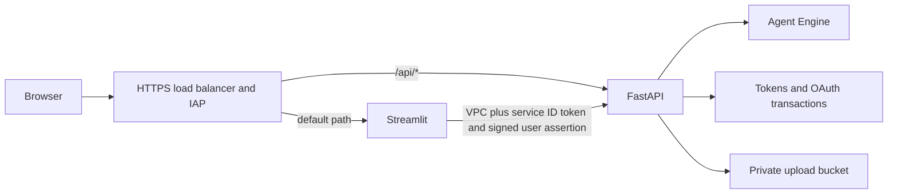

# Independent OSIRIS UI

The UI consists of a Streamlit frontend and a FastAPI backend. Both production
and test Cloud Run services are managed by Terraform. Existing production module
addresses are preserved with `moved` blocks; existing test services are discovered
and imported before apply. The network remains **mcp-agent-vpc**.

The reserved global load balancer IP is **136.81.113.202**
(`ui-frontend-global-ip`). Terraform pins this address and prevents its destruction.
Both `osiris.endava.app` and `test.osiris.endava.app` must resolve to it. DNS is
managed outside this repository; certificate provisioning requires valid DNS.

## Request and identity paths



Frontend egress is `ALL_TRAFFIC`, and the existing app subnet enables Private
Google Access. Frontend calls to the backend use a Cloud Run ID token in
`Authorization` and the user's signed IAP assertion in
`X-Goog-IAP-JWT-Assertion`. The backend also accepts IAP-protected requests through
the API serverless NEG. Its ingress is `internal-and-cloud-load-balancing`.

The backend verifies ES256 signatures, issuer, expiry, issued-at, lifetime,
configured audiences and identity claims. Trusted audience IDs are resolved
from explicitly configured backend service names, never from a request header.
A custom role grants only `compute.backendServices.get` for that lookup. There
is no production fallback to a mock user or an unsigned email header.

`iap_accessors` controls who can open the site. The configured developer group
is granted `roles/iap.httpsResourceAccessor` on both frontend and API backend
services. IAP's service identity is created by the backend stack before its
Cloud Run invoker bindings. The frontend service account's invoker permission
is scoped to the UI backend services; OAuth Secret Accessor is scoped to the six
required secrets. Upload signing permission is scoped to the backend's own
service account, and object creation to the landing-zone bucket.

## OAuth

Use the sidebar's Connect buttons to open the **public** origin, authorize the
provider, close the confirmation tab and retry the message. Each callback
uses `/api/auth/{provider}/callback` on the same public domain.

Transactions use random state and an HttpOnly, Secure, SameSite=Lax browser
cookie. Firestore binds state to the provider, verified user and browser, with
a ten-minute deadline and atomic single-use consumption. Google and Microsoft
use S256 PKCE. Atlassian uses its documented confidential 3LO code exchange with
a client secret and validated state; its Jira/Confluence documentation does not
specify the same PKCE contract. No tokens are returned to the browser.

Register **both production and test callback URLs** for all three OAuth clients.
The clients/secret versions must exist in Secret Manager before deploying:

- `GOOGLE_OAUTH_CLIENT_ID`, `GOOGLE_OAUTH_CLIENT_SECRET`
- `MICROSOFT_OAUTH_CLIENT_ID`, `MICROSOFT_OAUTH_CLIENT_SECRET`
- `ATLASSIAN_OAUTH_CLIENT_ID`, `ATLASSIAN_OAUTH_CLIENT_SECRET`
- `IAP_OSIRIS_CLIENT_ID`, `IAP_OSIRIS_CLIENT_SECRET`

The backend does not require all three providers before every conversation.
Users connect the sources they need; `REQUIRED_PROVIDERS` can explicitly enforce
a subset using a JSON list. Refresh requests have timeouts and a distributed
Firestore lease to avoid reusing a rotating refresh token across instances.
Expired transactions/abandoned leases use Firestore TTL cleanup.

## Agent and file handling

Production resolves exactly one live Agent Engine named `OSIRIS`. Test resolves
`OSIRIS - Test`. An optional `AGENT_RESOURCE_NAME` override is supported, but the
checked-in configuration has no stale resource ID. `/health` reports process
liveness; authenticated `/api/ready` refreshes the agent lookup and returns 503
if the agent is missing, inaccessible or ambiguous. A failed lookup is not
cached, and a failed stream invalidates the cache.

Deploy the test agent using the agent CI pipeline before testing the test UI.
Its `FIRESTORE_COLLECTION_NAME` is `test_user_oauth_tokens`; production uses
`user_oauth_tokens`. Agent CD preserves the test Agent Engine by default because
it is now a dependency of the independent test UI. Set
`_PRESERVE_UI_TEST_AGENT=false` only when deliberately removing that environment.

Every session lookup uses the verified user, and the backend checks ownership
before accepting a session ID. The SSE protocol includes `session_info`,
`agent_event`, `done` and `error`; the frontend treats an interrupted/error stream
as failure. User and agent text are rendered without `unsafe_allow_html`; thought
parts are omitted. Only controlled CSS/header templates use HTML.

Uploads support PDF, text, Markdown, CSV and DOCX, with a 20 MB limit. The backend
signs a five-minute PUT using ADC and IAM signBlob, with the exact content type
and byte count. Object paths contain a hashed user ID and UUID. The frontend
uploads the bytes and includes the resulting private GCS URI in the next message.
This implements the former upload stub; the agent still needs bucket read access
and its existing document/artifact tools to process the file.

## Deployment and state reconciliation

The frontend CD pipeline is the **single automatic owner of UI deployment**:

1. Run unit/regression tests and reconcile the deployer's UI-specific IAM roles.
2. Apply shared resources and verify/create the embedding model in a Cloud SDK step.
3. Discover/import compatible existing gateway objects and apply the gateway.
4. Bootstrap the frontend service account, build the backend image, import any
   existing test backend and apply both backend environments.
5. Build the frontend image, import any existing test frontend and apply both
   frontend environments and their IAP-protected load balancer routes.

The Terraform provisioner requiring `bq`/Bash was removed. Its state removal does
not delete the existing BigQuery model. `ensure_embedding_model.py` uses Cloud
SDK credentials and the BigQuery REST API; a 404 means absent, while read/auth
errors fail explicitly. Creation uses `CREATE MODEL IF NOT EXISTS` and bounded
retries, and success requires verifying the actual model. Local orchestration
uses the same script and honors `GOOGLE_IMPERSONATE_SERVICE_ACCOUNT`.

The gateway import procedure verifies an existing network is custom and that
subnets match the configured network, CIDR and purpose. It only imports objects
absent from the selected Terraform state; it does not delete existing networks,
subnets or services. Imports require choosing the correct project/backend and
reviewing state ownership. If an object is managed by another stack, resolve
that ownership before invoking deployment.

Cloud Build PR pipelines run tests, validate Terraform and build images. They
**do not apply infrastructure or deploy a shared test service**. The trigger
management script updates existing filters in place, covers dependency locks,
shared modules and scripts, and removes the obsolete independent backend push
trigger. Its retained build configuration is read-only, so even an unreconciled
legacy trigger cannot race the coordinated deployment. The coordinated UI push trigger remains restricted to `main`; pushing
a feature branch does not deploy production.

Existing triggers must be reconciled using `cicd_triggers_creation.sh`, invoked
by `creation_manager.sh`. Either UI flag selects the coordinated pipeline. The
Cloud Build deployer already requires project IAM administration; UI deployment
also needs `roles/iam.roleAdmin` and `roles/iap.admin`. Bootstrap grants these and
the UI CD preparation step reconciles them for already bootstrapped deployers.
The two new roles are for the deployer, not the application service accounts.

## Verification and local use

```bash
make verify-ui-ci
make build-ui
```

The checks cover forged/expired IAP claims, OAuth state/cookie/PKCE and replay,
session ownership, missing engines, stream failure, upload bounds/signing,
concurrent refresh, model creation failure and safe resource discovery. Images
use Python 3.12 slim, locked dependency groups and a nonroot user. There are no
file-based debug logs or telemetry clients initialized by importing UI config.

For explicit local development, using ADC and locally configured provider
credentials:

```bash
make run-ui-backend
make run-ui-frontend
```

These targets explicitly enable development mode with `dev@example.com`; that
fallback is never enabled by the production/test Terraform configuration. For
live acceptance, check HTTPS/IAP on both domains, verify `/api/ready`, complete
provider consent, send two messages in one session, reject a foreign session,
and upload a supported document. Local tests do not replace this acceptance run.

References: [Cloud Run private networking](https://docs.cloud.google.com/run/docs/securing/private-networking),
[IAP signed headers](https://docs.cloud.google.com/iap/docs/signed-headers-howto),
[Atlassian confidential 3LO](https://developer.atlassian.com/cloud/jira/platform/oauth-2-3lo-apps/).
