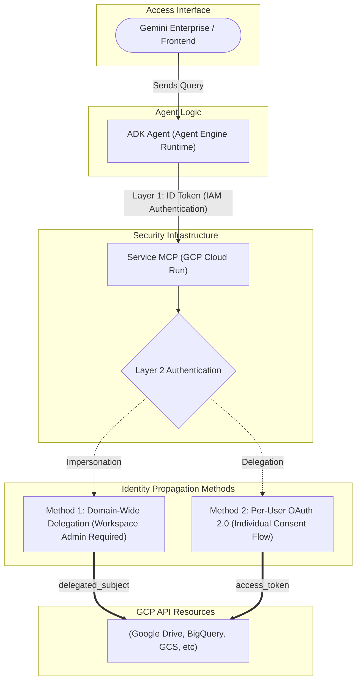
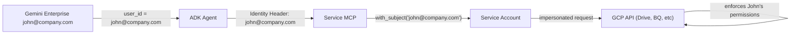
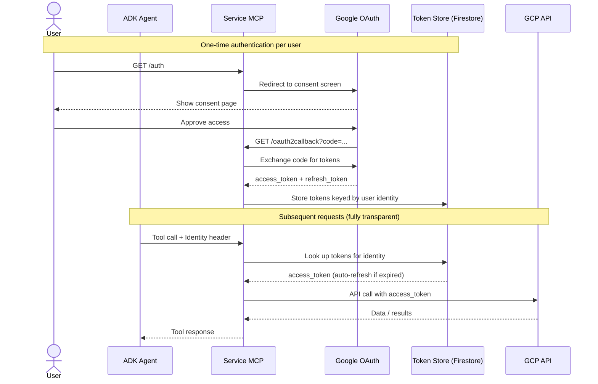

# GCP Services MCP — Authentication Methods

This document describes the available authentication strategies for MCP servers connecting to Google Cloud Services (Drive, BigQuery, GCS, etc.), how they behave inside and outside Gemini Enterprise, and a comparative table to help you choose the right one.

---

## Overview

A typical GCP Service MCP sits between the ADK Agent and the specific GCP API. There are **two separate auth layers**:

| Layer | Purpose | Who handles it |
|---|---|---|
| **Agent → MCP** | Prove the agent is allowed to call the MCP server | Cloud Run IAM (ID token) |
| **MCP → GCP API** | Prove the MCP has permission to access the user's data | One of the two methods below |

This document focuses on the **MCP → GCP API** layer.

---

## Method 1 — Domain-Wide Delegation (DWD)

### How it works

A **Service Account** is granted authority by a Google Workspace Admin to impersonate any user in the organisation. On each tool call, the MCP reads the identity header sent by the agent and builds credentials scoped to that user using `service_account.Credentials.with_subject(user_email)`.

### Setup (one-time, requires Workspace Admin)

1. Create a Service Account in GCP.
2. Download the JSON key and store it in Secret Manager.
3. In [admin.google.com](https://admin.google.com) → Security → API Controls → Domain-wide Delegation:
   - Authorize the SA Client ID with the necessary scopes for the specific GCP service (e.g., Drive, BigQuery).

### Inside Gemini Enterprise

Gemini Enterprise passes the authenticated user's identity in the ADK session. The agent's `header_provider` forwards it to the MCP. No user interaction required.

### Outside Gemini Enterprise (local / direct API)

Set the identity explicitly when creating the session. Works the same way — the SA impersonated whoever is specified.

> [!IMPORTANT]
> Requires a **Google Workspace Super Admin** to configure Domain-Wide Delegation. Not available in personal Gmail accounts.

---

## Method 2 — Per-User OAuth 2.0 (Browser Redirect)

### How it works

Each user authenticates once via Google's OAuth2 consent screen. The MCP exchanges the authorization code for an **access token + refresh token**. Tokens are stored persistently (e.g., Firestore) keyed by user identity. The `google-auth` library auto-refreshes the access token transparently for subsequent requests.

### Token Lifetime

| Token | Lifetime |
|---|---|
| Access token | ~1 hour (auto-refreshed transparently) |
| Refresh token | Effectively permanent* |

> *The refresh token only expires if: the user manually revokes access, the OAuth app is in **Testing** mode, or the token goes unused for a long period.

### Inside Gemini Enterprise

A one-time setup is needed per user. The agent detects when a user's token is missing and provides the `/auth` URL. After consent, all future requests are transparent.

### Outside Gemini Enterprise (local dev)

Visit the `/auth` endpoint in a browser, complete Google consent, and the MCP is ready. This is the recommended approach during **local development**.

---

## Comparative Table

| Feature | DWD (Method 1) | Per-User OAuth (Method 2) |
|---|:---:|:---:|
| **Workspace Admin required** | ✅ Yes | ❌ No |
| **User must authenticate** | ❌ No | ✅ Once per user |
| **Per-user data isolation** | ✅ Full | ✅ Full |
| **GCP native ACLs enforced** | ✅ Yes | ✅ Yes |
| **Token management** | ❌ None needed | ⚠️ Needs persistent store |
| **Works with personal Gmail** | ❌ No | ✅ Yes |
| **Works in Gemini Enterprise** | ✅ Seamless | ⚠️ One-time setup per user |
| **Local dev friendly** | ⚠️ Needs secret | ✅ Easy (`/auth` in browser) |
| **Recommended for production** | ✅ Best for Org | ✅ Good for non-Admin/Mixed |

---

## Recommendation by Scenario

| Scenario | Recommended Method |
|---|---|
| Google Workspace org + admin access | **Method 1 (DWD)** |
| Google Workspace org, no admin access | **Method 2 (OAuth + Persistence)** |
| Local development & testing | **Method 2 (OAuth, in-memory)** |
| Personal Gmail users | **Method 2 (OAuth)** |
