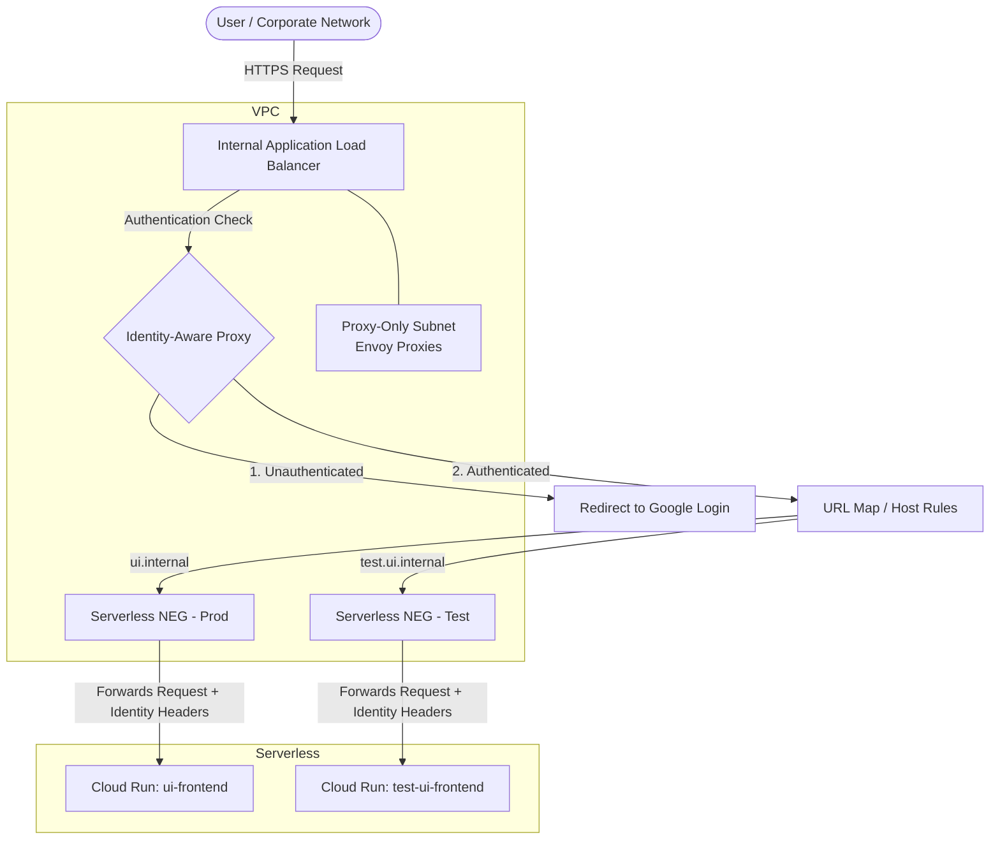

# Network Security Architecture: ILB, VPC, IAP, and Serverless NEGs

This document explains the network security architecture for the OSIRIS application, detailing the interactions between the Virtual Private Cloud (VPC), Internal Application Load Balancers (ILB), Identity-Aware Proxy (IAP), and Serverless Network Endpoint Groups (NEGs).

## 1. Components Overview

### Virtual Private Cloud (VPC)
The VPC is the foundational private network in Google Cloud. It isolates our infrastructure from the public internet.
*   **Purpose**: Provides a secure, private communication boundary. 
*   **Proxy-Only Subnet**: Our architecture uses an Envoy-based Internal Application Load Balancer. This requires a dedicated "proxy-only subnet" within the VPC, which Google Cloud uses to run the managed Envoy proxies that handle the traffic routing.

### Internal Application Load Balancer (ILB)
The ILB acts as the internal entry point (API Gateway) for all traffic destined for our frontend and backend services.
*   **Purpose**: Handles URL routing (e.g., routing `ui.internal` to production and `test.ui.internal` to testing environments), TLS termination, and traffic distribution.
*   **Security Role**: Since it is an *Internal* Load Balancer, it does not have a public IP address. It can only be accessed by clients within the VPC (or connected via VPN/Cloud Interconnect), drastically reducing the network attack surface.

### Identity-Aware Proxy (IAP)
IAP is a Zero Trust access proxy that sits at the Load Balancer layer.
*   **Purpose**: Acts as the authentication gatekeeper. It intercepts incoming requests at the Load Balancer and verifies the user's identity via Google Workspace/Cloud Identity before allowing the traffic to reach the backend application.
*   **Security Role**: Ensures that only authenticated and authorized users can access the application, without relying solely on corporate network perimeter defenses. It injects identity headers (such as `X-Goog-Authenticated-User-Email`) into the request once the user is validated.

### Serverless Network Endpoint Groups (NEGs)
A Serverless NEG is a networking abstraction that allows a Load Balancer to route traffic directly to a serverless compute service, like Cloud Run.
*   **Purpose**: Acts as the bridge between the VPC-bound Load Balancer and the serverless Cloud Run instances.
*   **Security Role**: By using NEGs, we can configure our Cloud Run instances with `ingress = "INGRESS_TRAFFIC_INTERNAL_LOAD_BALANCER"`. This setting physically blocks any direct internet traffic to the Cloud Run service. The service will *only* accept traffic that comes specifically through the Load Balancer (and therefore, through IAP).

---

## 2. Interaction Flow

The following diagram illustrates how a user request traverses these components to securely reach the Cloud Run application.

### Step-by-Step Execution

1. **User Request**: A user connected to the corporate network (or VPN) attempts to access `https://ui.internal`. The request hits the Internal Application Load Balancer's private IP address inside the **VPC**.
2. **Proxy-Only Subnet Processing**: The LB uses Envoy proxies provisioned transparently in the **Proxy-Only Subnet** to process the incoming HTTP/HTTPS traffic.
3. **IAP Interception**: The Load Balancer passes the request to **IAP**. 
    * If the user has no valid session, IAP pauses the request and redirects the user to the Google OAuth login screen.
    * If the user is successfully authenticated, IAP generates a signed JWT, extracts the user's email, and injects them into the HTTP request headers.
4. **URL Map Routing**: The Load Balancer evaluates its routing rules. Based on the requested host (e.g., `ui.internal`), it forwards the request to the designated **Serverless NEG**.
5. **NEG to Serverless Bridge**: The **Serverless NEG** securely points traffic directly to the fully-managed **Cloud Run** service.
6. **Ingress Enforcement**: The Cloud Run instance receives the request. Because its Ingress setting is strictly limited to the Internal Load Balancer, it accepts the traffic. Any attempt to bypass the VPC and call the Cloud Run URL directly over the public internet is forcefully dropped at the Google network edge.

---

## 3. Why This Architecture?

* **Defense in Depth**: Security is enforced at two distinct layers. The VPC/ILB blocks unauthorized network origins (preventing public internet access), while IAP blocks unauthorized user identities (Zero Trust).
* **No Public Exposure**: At no point is the application exposed to the public internet. The ILB uses private IPs, and Cloud Run rejects any non-ILB traffic.
* **Seamless Scalability**: Serverless NEGs allow us to marry the strict network security controls of a VPC with the auto-scaling, serverless benefits of Cloud Run.
