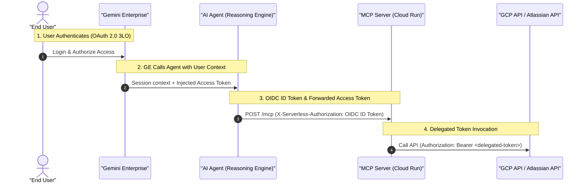

# Implementation Plan - Atlassian (Jira & Confluence) MCP Server

This implementation plan details the architectural blueprint, design standards, and execution steps for adding a unified Atlassian (Jira & Confluence) MCP server. It is based on the patterns extracted from the existing Google Calendar, Google Drive, and Microsoft OneDrive MCP servers in the repository and strictly aligns with the requirements of `.agents/rules/mcp-server-guide.md`.

---

## 1. Extracted Reference Architecture & Mechanics

### 1.1 Folder & File Structure Standards
Every custom Python MCP server in `mcp_servers/` must adhere to this uniform layout:
```text
mcp_servers/atlassian/
├── app/
│   ├── __init__.py
│   ├── config.py           # BaseSettings for environment variables & API scopes
│   ├── main.py             # Entry point (args parser, binds FastMCP settings, runs streamable-http)
│   ├── mcp_server.py       # FastMCP instantiation, @mcp.tool() definitions, TokenVerifier registration
│   ├── schemas.py          # Request and Response Pydantic models (with description & metadata)
│   ├── security.py         # AtlassianTokenVerifier and client factory helper
│   ├── gcs_connector.py    # Standard GCS Landing Zone zero-copy uploader & IAM conditions manager
│   └── atlassian/          # Sub-package for Jira and Confluence client wrappers
│       ├── __init__.py
│       ├── client.py       # Main API client delegating to jira/confluence endpoints
│       └── schemas.py      # Internal data structures returned by the client
├── tests/                  # Pytest unit and integration tests
├── Dockerfile              # Containerization configuration
└── README.md               # User documentation and setup/Make commands
```

### 1.2 Gemini Enterprise Connection Flow
The connection between the Agent Engine runtime, the MCP server, and Gemini Enterprise relies on a **Dual Authentication Architecture**:



#### Dual Authentication Mechanisms:
1. **Service-to-Service (Agent -> Cloud Run)**:
   - MCP servers run as protected Cloud Run services.
   - The Agent uses `google.oauth2.id_token.fetch_id_token` or local ADC to retrieve an OpenID Connect (OIDC) ID token scoped to the MCP server's URL.
   - This ID token is injected into the `X-Serverless-Authorization` header of all tool calls. Cloud Run verifies this OIDC token via IAM.
2. **End-User Privacy (MCP -> Atlassian)**:
   - Gemini Enterprise manages the end-user OAuth 2.0 handshake and stores the resulting Atlassian Access Token.
   - The token is injected into the Agent's runtime session context (`ctx.state`) under the corresponding `GEMINI_GOOGLE_AUTH_ID` key.
   - The Agent's `MCPToolsetBuilder` extracts this token at runtime and passes it to the MCP server via the `Authorization: Bearer <token>` header.
   - **Crucial Rule**: To avoid deadlocks in production, we do not register local `auth_credential` blocks on `McpToolset` when running in production, as Reasoning Engine cannot receive OAuth browser redirects.

### 1.3 Token Verification Pattern
To validate the delegated token inside the FastMCP server, a custom `TokenVerifier` class must be defined in `security.py`:
- For Google: Calls `https://oauth2.googleapis.com/tokeninfo`.
- For Microsoft: Calls `https://graph.microsoft.com/v1.0/me`.
- **For Atlassian (Jira & Confluence)**: Calls `https://api.atlassian.com/oauth/token/accessible-resources` to verify the token is active and lists accessible cloud sites (Cloud IDs).

### 1.4 GCS Landing Zone File Ingestion Pattern
For tools that read files/attachments (e.g., Confluence pages, PDF attachments, Jira files), the server **must not** return raw binary or text data directly. It must stream the file to the GCS Landing Zone bucket:
1. **Path structure**: `gs://{LANDING_ZONE_BUCKET}/{app_name}/{user_id}/{session_id}/atlassian-{timestamp}-{filename}`
2. **Original Filename**: Preserve the original filename and extension exactly.
3. **Dynamic Authorization (IDOR Prevention)**:
   - Inject an IAM condition into the bucket's policy to grant `roles/storage.objectAdmin` to `user:{user_id}`.
   - Condition expression: `resource.name.startsWith("projects/_/buckets/{LANDING_ZONE_BUCKET}/objects/{app_name}/{user_id}/")`.
   - Condition title: `"uploader-folder-access"`.
   - Skip updating if the condition binding already exists.
4. **Multimodal Ingestion**: The tool returns the GCS URI (`gcs_uri`), the MIME type (`mime_type`), and the flag `inject_file_data: True` in the public response schema so the `MultimodalFileInjectionPlugin` intercepts it and loads it natively.

---

## 2. Proposed Changes for Atlassian Connectors

### 2.1 Component: Atlassian MCP Server (`mcp_servers/atlassian/`)

#### [NEW] [config.py](file:///Users/jromero/DEV/endava/Research-Agent/mcp_servers/atlassian/app/config.py)
Pydantic settings to load and validate environment variables:
- `AtlassianServerConfig`: server name, host, port (e.g., local port `8085`), log level, stateless HTTP mode.
- `AtlassianAPIConfig`: OAuth scopes (e.g., `read:jira-work`, `read:confluence-content.all`, `offline_access`) and endpoint URLs.

#### [NEW] [schemas.py](file:///Users/jromero/DEV/endava/Research-Agent/mcp_servers/atlassian/app/schemas.py)
All tool requests and responses structured as Pydantic models. 
- **Base Request & Dependencies**: Public requests must inherit from `BaseRequest` (holding `AgentDependencies`) to support app context injection. The dependencies are excluded from the schema (`exclude=True`) to prevent LLM hallucination.
- **Validation & Thin Tools**: All input parameter validation, complex regex parsing, and path construction MUST be handled within the Pydantic `Request` models (e.g. using `Field(pattern=...)`, `@property`, or `@model_validator`). Never include input validation inside the tool body in `mcp_server.py`.

```python
from typing import Annotated, Optional
from pydantic import BaseModel, Field

class AgentDependencies(BaseModel):
    app_name: Annotated[
        str, 
        Field(
            description="The name of the calling application or agent.", 
        ),
    ]
    user_id: Annotated[
        str, 
        Field(
            description="The unique identifier of the user using the agent",
        ),
    ]
    session_id: Annotated[
        str, 
        Field(
            description="The current session or conversation ID with the agent",
        )
    ]

class BaseRequest(BaseModel):
    dependencies: Annotated[
        Optional[AgentDependencies],
        Field(
            default=None,
            exclude=True,
            description="Parameters injected by the framework. Excluded to avoid LLM hallucinations.",
        ),
    ]
```

- `SearchJiraIssuesRequest` & `SearchJiraIssuesResponse`
- `GetJiraIssueDetailsRequest` & `GetJiraIssueDetailsResponse`
- `SearchConfluencePagesRequest` & `SearchConfluencePagesResponse`
- `ReadConfluencePageRequest` & `ReadConfluencePageResponse`
- `ListJiraProjectsRequest` & `ListJiraProjectsResponse`
- `GetJiraProjectDetailsRequest` & `GetJiraProjectDetailsResponse`
- `ListJiraProjectComponentsRequest` & `ListJiraProjectComponentsResponse`
- `ListJiraProjectCategoriesRequest` & `ListJiraProjectCategoriesResponse`

#### [NEW] [security.py](file:///Users/jromero/DEV/endava/Research-Agent/mcp_servers/atlassian/app/security.py)
- `AtlassianTokenVerifier(TokenVerifier)`: verifies Atlassian OAuth access tokens using the accessible resources endpoint.
- `create_atlassian_client()`: extracts the verified access token using `get_access_token()` and initializes the client wrapper.

#### [NEW] [gcs_connector.py](file:///Users/jromero/DEV/endava/Research-Agent/mcp_servers/atlassian/app/gcs_connector.py)
- Standard streaming uploader to `gs://{LANDING_ZONE_BUCKET}` with `uploader-folder-access` IAM policy configuration.

#### [NEW] [client.py](file:///Users/jromero/DEV/endava/Research-Agent/mcp_servers/atlassian/app/atlassian/client.py)
- Atlassian client class that wraps HTTP requests to Jira (`https://api.atlassian.com/ex/jira/{cloud_id}/rest/api/3/...`) and Confluence (`https://api.atlassian.com/ex/confluence/{cloud_id}/rest/api/...`).

#### [NEW] [mcp_server.py](file:///Users/jromero/DEV/endava/Research-Agent/mcp_servers/atlassian/app/mcp_server.py)
Instantiates `FastMCP` with `AtlassianTokenVerifier()`, registering:
- `search_jira_issues(request: SearchJiraIssuesRequest) -> SearchJiraIssuesResponse`
- `get_jira_issue_details(request: GetJiraIssueDetailsRequest) -> GetJiraIssueDetailsResponse`
- `search_confluence_pages(request: SearchConfluencePagesRequest) -> SearchConfluencePagesResponse`
- `read_confluence_page(request: ReadConfluencePageRequest) -> ReadConfluencePageResponse`
- `list_jira_projects(request: ListJiraProjectsRequest) -> ListJiraProjectsResponse`
- `get_jira_project_details(request: GetJiraProjectDetailsRequest) -> GetJiraProjectDetailsResponse`
- `list_jira_project_components(request: ListJiraProjectComponentsRequest) -> ListJiraProjectComponentsResponse`
- `list_jira_project_categories(request: ListJiraProjectCategoriesRequest) -> ListJiraProjectCategoriesResponse`
- **Mandatory Wrapper Pattern**: `@mcp.tool()` wrappers should only handle unpacking the request, calling the underlying client (via `asyncio.to_thread` for blocking I/O), and packing the response. Catch and return exceptions gracefully within the `Response` model.

#### [NEW] [main.py](file:///Users/jromero/DEV/endava/Research-Agent/app/main.py)
- Standard argument parser to run the server on `streamable-http`.

#### [NEW] [Dockerfile](file:///Users/jromero/DEV/endava/Research-Agent/mcp_servers/atlassian/Dockerfile)
- Standard multi-stage Python container optimized for uv dependency loading.

### 2.2 Component: Agent Integration (`agent/`)

#### [MODIFY] [mcp_settings.py](file:///Users/jromero/DEV/endava/Research-Agent/agent/core_agent/config/mcp_settings.py)
- Add `AtlassianMCPConfig` to configure Atlassian MCP endpoints (URL: `http://localhost:8085`, endpoint: `/mcp`), OAuth scopes, and `GEMINI_GOOGLE_AUTH_ID` (using `AliasChoices("ATLASSIAN_AUTH_ID", "GEMINI_GOOGLE_AUTH_ID")`).

#### [MODIFY] [agent.py](file:///Users/jromero/DEV/endava/Research-Agent/agent/core_agent/agent.py)
- Import `ATLASSIAN_MCP_CONFIG` from config.
- Register `ATLASSIAN_MCP_CONFIG` in `research_agent` under `.with_mcp_servers(...)`.

### 2.3 Component: Infrastructure & Deployment (`terraform/` & `Makefile`)

#### [NEW] [atlassian_mcp_server_resources/](file:///Users/jromero/DEV/endava/Research-Agent/terraform/atlassian_mcp_server_resources/)
- Codify Cloud Run deployment for Atlassian MCP server.
- Add `main.tf`, `variables.tf`, `terraform.tfvars`, and Cloud Build YAML targets (`mcp-server-services-cloud-build-ci.yaml`, `mcp-server-services-cloud-build-cd.yaml`).

#### [MODIFY] [Makefile](file:///Users/jromero/DEV/endava/Research-Agent/Makefile)
- Add commands for local pre-commit, tests, running locally (port 8085), building images, and verifying CI.
- Add `ATLASSIAN_PROD_URL` environment variables and inject them into `deploy-agent` targets.

### 2.4 Component: Secrets Management & CD Integration

#### GCP Secret Manager Configuration
To authenticate the Atlassian MCP server with the Jira Cloud REST API, the user's email, API token, instance URL, and cloud ID will be securely stored as a JSON object in **GCP Secret Manager** and mapped dynamically to the Cloud Run service at runtime.

1. **Secret JSON Structure**:
   ```json
   {
     "JIRA_USER_EMAIL": "javier.romero@estrategia52.com",
     "JIRA_API_TOKEN": "ATATT3xFfGF0KfJKIWzPhU0lAKNBROhM3dM2f2OSScNR1Baz8B_w_GstrPN3OhR-dx8nUwuEyKHedxIfCCLCSflc8N2RAhxExr1fWyyrSHiRrYEVhu34GGGzJ8qjhn5Zj38ss_4vIxdv-ESB6yV6cGGpwQ8-2a7T5oYA4aK0pTr5ewtlu8s2gyQ=076AB55A",
     "JIRA_INSTANCE_URL": "https://davaflow.atlassian.net",
     "JIRA_CLOUD_ID": "63e911d9-84b8-498c-a4f9-47c0c85828c0"
   }
   ```

2. **Secret Creation**: Create the secret named `ATLASSIAN_CREDENTIALS` using `gcloud`:
   ```bash
   echo -n '{
     "JIRA_USER_EMAIL": "javier.romero@estrategia52.com",
     "JIRA_API_TOKEN": "ATATT3xFfGF0KfJKIWzPhU0lAKNBROhM3dM2f2OSScNR1Baz8B_w_GstrPN3OhR-dx8nUwuEyKHedxIfCCLCSflc8N2RAhxExr1fWyyrSHiRrYEVhu34GGGzJ8qjhn5Zj38ss_4vIxdv-ESB6yV6cGGpwQ8-2a7T5oYA4aK0pTr5ewtlu8s2gyQ=076AB55A",
     "JIRA_INSTANCE_URL": "https://davaflow.atlassian.net",
     "JIRA_CLOUD_ID": "63e911d9-84b8-498c-a4f9-47c0c85828c0"
   }' | gcloud secrets create ATLASSIAN_CREDENTIALS \
     --data-file=- \
     --project=[PROJECT_ID]
   ```
3. **Access Control**: Grant the Atlassian MCP Server's Service Account (`atlassian-mcp-server`) access to the secret:
   - In `terraform/atlassian_mcp_server_resources/terraform.tfvars`, add `"roles/secretmanager.secretAccessor"` to `mcp_server_iam_project_roles`.

#### Cloud Run Environment Mapping
In `terraform/atlassian_mcp_server_resources/main.tf`, retrieve and map the secret to the Cloud Run container via `env_from_key`:
```tf
  containers = {
    mcp-server = {
      image = "${local.cloud_run_image}:${var.mcp_server_cloud_run_image_tag}"
      env   = var.mcp_server_cloud_run_env
      env_from_key = {
        "ATLASSIAN_CREDENTIALS" = {
          secret  = "ATLASSIAN_CREDENTIALS"
          version = "latest"
        }
      }
    }
  }
```

#### Cloud Build CD (`mcp-server-services-cloud-build-cd.yaml`)
* The Cloud Run instance will resolve and retrieve the `ATLASSIAN_CREDENTIALS` secret JSON value at runtime using its delegated Service Account identity. This keeps secrets out of Cloud Build configurations.

---

## 3. Verification Plan

### 3.1 Automated Verification
1. Run local tests:
   ```bash
   make run-atlassian-tests
   ```
2. Run pre-commit checks:
   ```bash
   make run-atlassian-precommit
   ```
3. Verify CI pipeline locally:
   ```bash
   make verify-atlassian-ci
   ```

### 3.2 Manual Terminal Smoke Testing
We will create a JSON-RPC smoke test script at `mcp_servers/atlassian/scripts/mcp_smoke_test.py`. To run manual tests from the terminal:

1. **Start the MCP Server Locally**:
   Open a terminal window and run:
   ```bash
   make run-atlassian-mcp-locally
   ```
   *This loads the environment variables from [mcp_servers/atlassian/.env](file:///Users/jromero/DEV/endava/Research-Agent/mcp_servers/atlassian/.env) and starts the FastMCP server on port 8085.*

2. **Execute the Smoke Test Client**:
   In a second terminal window, run:
   ```bash
   make run-atlassian-mcp-smoke
   ```
   *This script initializes the JSON-RPC connection, lists the exposed tools, and executes test calls to `list_jira_projects`, `list_jira_project_categories`, and `search_jira_issues` using your actual credentials to verify connectivity and API parsing.*

### 3.3 Manual Notebook Verification
- Deploy the MCP server to Cloud Run and run the `notebooks/atlassian_mcp_smoke_test.ipynb` to verify that Jira and Confluence endpoints connect, authenticate, query data, and ingest pages into the GCS Landing Zone correctly.
